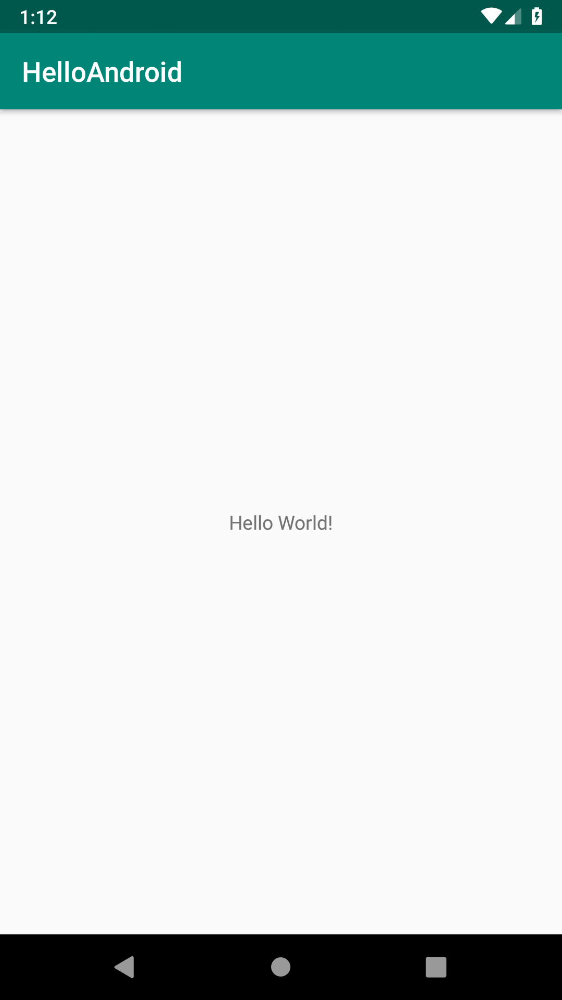
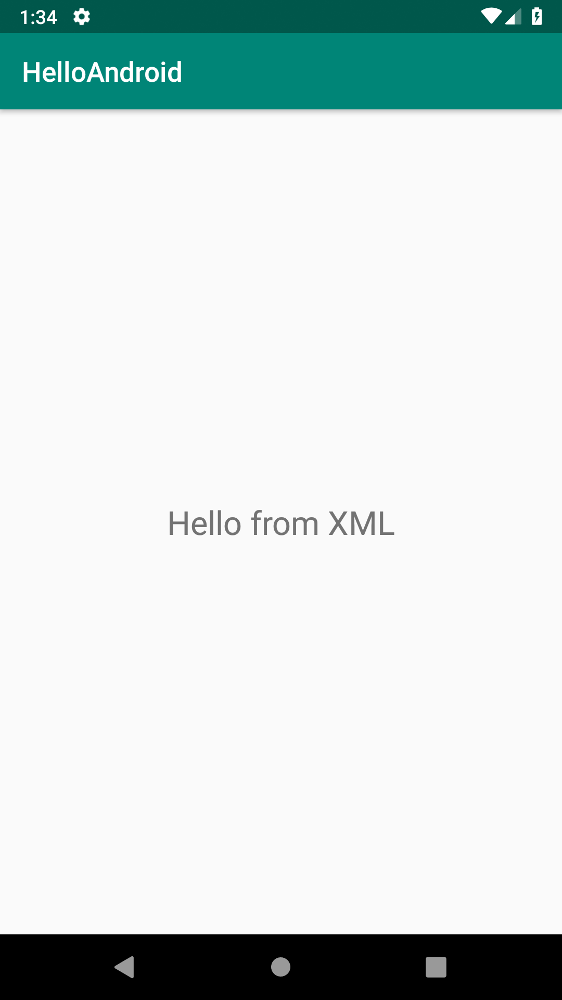
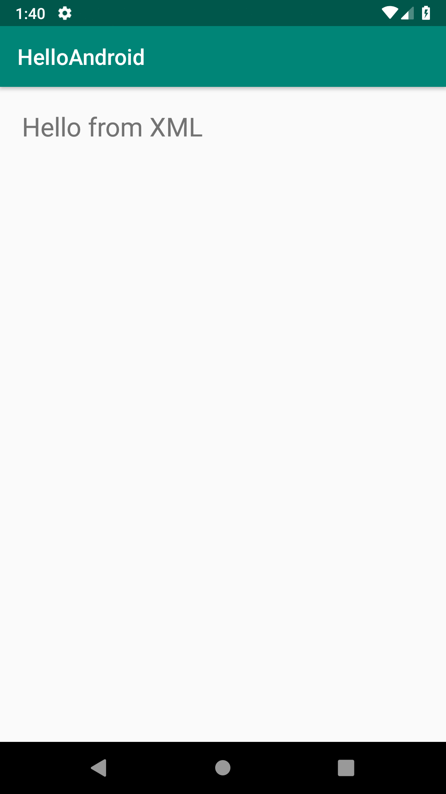
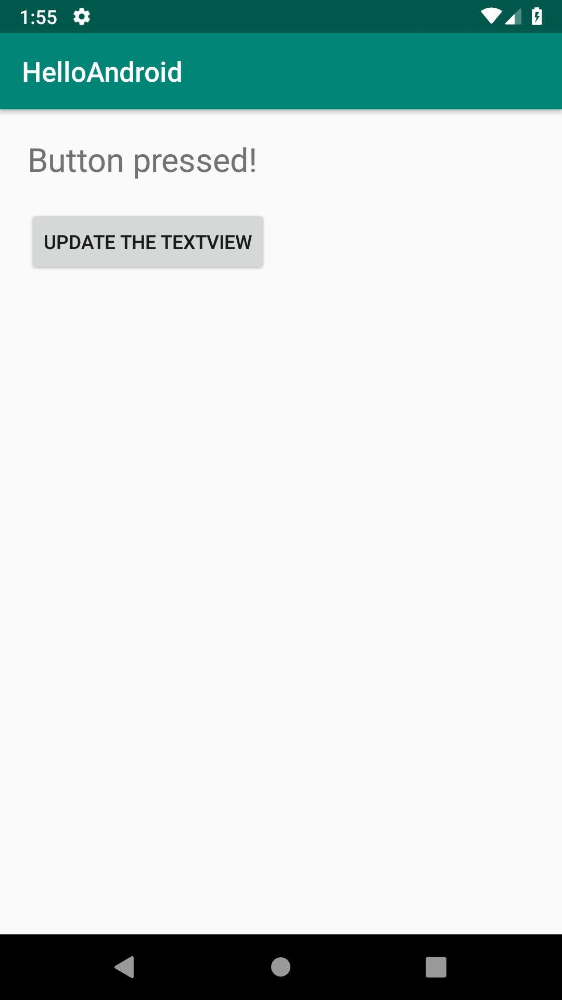
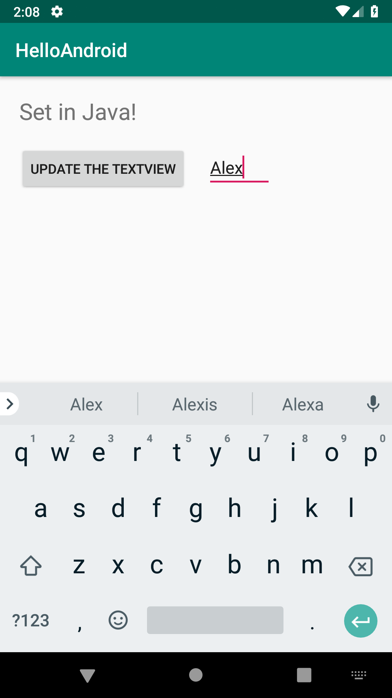
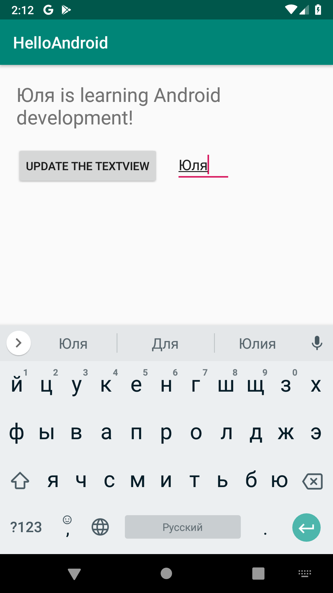
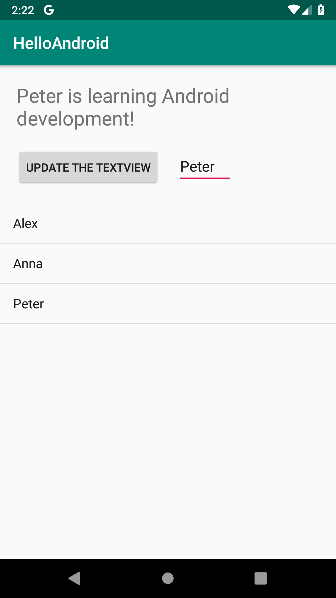

# Mobile-development


## Практика студентов Финансового университета


# Java Android Studio
__________________________________________

# [Методичка](http://koroteev.site/md/)


- # Установка Android Studio. “Hello, World”

Цель работы

    Получить навыки установки и первоначальной настройки среды разработки, получить базовое представление о структуре приложения и порядке его запуска.
## Задания для выполнения
Установите на компьютер среды разработки JDK и Android Studio.

Запустите Android Studio. 

Создайте новый пустой проект на языке программирования Java.

Познакомьтесь со структурой проекта и с содержанием главных файлов:

```text
MainActivity.java
activity_main.xml
AndroidManifest.xml
strings.xml
```

Найдите в справочном материале и кратко опишите своими словами назначение и содержание каждого из этих файлов.

Познакомьтесь с присутствующими в проекте ресурсами.

Запустите этот проект на виртуальном устройстве Android. 

Если виртуальных устройств не существует, создайте.

Модифицируйте проект таким образом, чтобы в названии приложения выводилась Ваша фамилия, а в строке на главном экране - любая другая строка по Вашему желанию.

Запустите данное приложение на нескольких виртуальных устройствах с разными версиями API и разными размерами и разрешениями экрана. 

## Методические указания
Скачать JDK можно с сайта Oracle (http://www.oracle.com)

Чтобы скачать JDK нужно сначала принять условия лицензионного соглашения, а затем выбрать нужную версию.

После скачивания запустите setup-файл и установите JDK.

Скачать среду можно с сайта для разработчиков Android (http://developer.android.com/sdk/index.html).

## Контрольные вопросы
Что такое Activity и зачем оно нужно?

Что такое View и зачем оно нужно?

Что такое Layout и зачем оно нужно?

Почему все строки в Layout указываются косвенно из файла с ресурсами?

Что такое версия API?

## Дополнительные задания

Замените RelativeLayout в главном окне приложения на LinearLayout с вертикальным расположением элементов.

Присвойте строке, отображаемой в TextView идентификатор следующим атрибутом:
```android:id=”@+id/main_textview”```

Измените название ресурса строки на “text1”

Модифицируйте строку динамически из кода Java, добавив в обработчик события onCreate следующий код:

```java
// 1. Access the TextView defined in layout XML
// and then set its text
mainTextView = (TextView) findViewById(R.id.main_textview);
mainTextView.setText(“Set in Java!”);
```

# Тестирование

https://docs.google.com/forms/d/e/1FAIpQLSfWQa4NqEeXnldrpDkBWI8sQgfg33w4Kjdb5Sx0PsCtMYdzGA/viewform

- # Layout’ы и View
Цель работы

    Познакомится с основными визуальными элементами приложения и приемами работы с ними
## Задания для выполнения
Внимательно прочтите и повторите в своем проекте методические указания.

Попробуйте креативно подойти к размещению и оформлению элементов. Экспериментируйте.

## Методические указания

- # Начальное состояние

Давайте познакомимся с содержимым основных файлов нашего проекта.

```MainActivity.java``` сожержит исполняемый код нашего приложения. Сейчас он содержит класс основного активити и код метода, вызываемого при загрузке нашего приложения:

```java
package com.example.helloandroid;


import android.support.v7.app.AppCompatActivity;
import android.os.Bundle;


public class MainActivity extends AppCompatActivity {


    @Override
    protected void onCreate(Bundle savedInstanceState) {
        super.onCreate(savedInstanceState);
        setContentView(R.layout.activity_main);
    }
}
```

``activiy_main.xml`` содержит описание расположения элементов на нашем основном активити. Сейчас мы видим в нем два элемента - Layout и текстовое представление внутри него:

```xml
<?xml version="1.0" encoding="utf-8"?>
<android.support.constraint.ConstraintLayout xmlns:android="http://schemas.android.com/apk/res/android"
    xmlns:app="http://schemas.android.com/apk/res-auto"
    xmlns:tools="http://schemas.android.com/tools"
    android:layout_width="match_parent"
    android:layout_height="match_parent"
    tools:context=".MainActivity">


    <TextView
        android:layout_width="wrap_content"
        android:layout_height="wrap_content"
        android:text="Hello World!"
        app:layout_constraintBottom_toBottomOf="parent"
        app:layout_constraintLeft_toLeftOf="parent"
        app:layout_constraintRight_toRightOf="parent"
        app:layout_constraintTop_toTopOf="parent" />


</android.support.constraint.ConstraintLayout>
```

Элемент *TextView* - это и есть строка текста. 

Подробнее про этот элемент читайте в документации: TextView

```strings.xml``` содержит текстовые ресурсы - строки, которые использует приложение. Сейчас в нем одна строка - название приложения:

```java
<resources>
    <string name="app_name">HelloAndroid</string>
</resources>
```

Давайте запустим это приложение в эмуляторе. На экране виртуального устройства мы должны увидеть следующее:



- # Модификация строки
Сейчас строка, отображаемая на экране забита в коде layout’а. 
Обычно это считается плохим тоном при разработке поддерживаемых приложений. 
Поэтому давайте выделим эту строку в текстовый ресурс:

```xml
<resources>
    <string name="app_name">HelloAndroid</string>
    <string name="greetings">Hello from XML</string>
</resources>
```

В файле ``activiy_main.xml`` заменим саму строку на ссылку на текстовый ресурс:

```android:text="@string/greetings"```

Заодно добавим новый атрибут, задающий размер шрифта.

```android:textSize="24dp"```

В общем, наша текстовая строка принимает такой вид:

```java
    <TextView
        android:layout_width="wrap_content"
        android:layout_height="wrap_content"
        android:text="@string/greetings"
        app:layout_constraintBottom_toBottomOf="parent"
        app:layout_constraintLeft_toLeftOf="parent"
        app:layout_constraintRight_toRightOf="parent"
        app:layout_constraintTop_toTopOf="parent"
        android:textSize="24dp"/>
```

Проверим правильность внесенных правок, запустив приложение на эмуляторе. Вы должны увидеть следующее:



- # Другое расположение
Обратите внимание на первую строку в файле ```activiy_main.xml:```


        <android.support.constraint.ConstraintLayout

Он задает вид расположения элементов. 
Давайте воспользуемся более простым представлением - LinearLayout. 
Подробнее про это расположение документация. 
Исправим эту строку на следующую:

    <LinearLayout

Зададим вертикальное расположение элементов. Таким образом, элементы, входящие в этот layout будут расположены один под другим:

    android:orientation="vertical"

Вы можете заметить, что теперь строка расположена вплотную к левому верхнему углу экрана. Чтобы добавить отступ модифицируем элемент TextView, добавив два следующих атрибута:

```
android:layout_marginTop="20dp"
android:layout_marginLeft="20dp"
```

Проверим расположение элемента в эмуляторе:



- # Доступ к ресурсам из кода
Для того, чтобы приложение было динамическим, нужно иметь возможность изменять визуальные элементы и их свойства из программного кода. 

Для этого хотя бы нужно уметь обращаться к ним из файла с кодом активити. 

Для этого у каждого элемента должен быть уникальный идентификатор, по которому его можно найти. 
Добавим атрибут id к нашему текстовому полю:
```android:id="@+id/main_textview"```


Теперь перейдем в файл MainActivity.java. 

Внутри основного класса, но вне методов введем новый член класса - переменную, которая будет содержать ссылку на наше текстовое поле:
```TextView mainTextView;```

Скорее всего на этом моменте студия предупредит, что присутствует неизвестный идентификатор TextView. Этот класс объявлен в одном из пакетов Android SDK. 

Студия предложит автоматические его импортировать:
```import android.widget.TextView;```

Дальнейшие действия будем производить внутри метода onCreate().

Теперь найдем нужный элемент по его идентификатору:
```mainTextView = findViewById(R.id.main_textview);```

Теперь мы можем изменить его свойства из программного кода:
```mainTextView.setText("Set in Java!");```

Так как метод onCreate() выполняется сразу при запуске приложения, запустив его в эмуляторе мы должны сразу увидеть модифицированную строку.


- # Простая кнопка
Добавим кнопку к нашему приложению. 
Для того, чтобы на кнопке отображалась надпись, заранее создадим для нее текстовый ресурс:

```html
<string name="button">Update The TextView</string>
```

Теперь создадим непосредственно кнопку. 
Этот элемент называется button. 
Подробнее про работу с этим элементов читайте документацию. 
Расположим ее внутри нашего линейного layout’а после текстового поля. Так она расположится непосредственно под ним.

```java
<Button
   android:id="@+id/main_button"
   android:layout_width="wrap_content"
   android:layout_height="wrap_content"
   android:layout_marginStart="20dp"
   android:layout_marginLeft="20dp"
   android:layout_marginTop="20dp"
   android:text="@string/button" />
   ```

Теперь добавим обработчик события нажатия на кнопку. 

Для этого, нам нужно указать, что наш класс реализует интерфейс обработчика события тапа. Для этого изменим строку объявления класса:

```public class MainActivity extends AppCompatActivity { ```

Добавив объявление реализации интерфейса:

```
public class MainActivity extends AppCompatActivity implements View.OnClickListener {
```

Теперь создадим переменную-ссылку на кнопку:

``Button mainButton;``

Найдем кнопку по  идентификатору:

``mainButton = findViewById(R.id.main_button);``

Теперь зададим ей обработчик события, указав, какой класс будет его обрабатывать (в данном случае, текущий):

``mainButton.setOnClickListener(this);``

Создадим метод-обработчик события и в нем изменим значение текстового поля:

```
@Override
public void onClick(View v) {
   mainTextView.setText("Button pressed!");
}
```

Теперь при нажатии на кнопку надпись в текстовом поле должна измениться:




- # Текстовый ввод
Теперь мы будем добавлять поле текстового ввода. 
Для этого добавим еще один вложенный линейный layout после текстового поля и поместим нашу кнопку внутрь него:

```
<LinearLayout
   android:layout_width="wrap_content"
   android:layout_height="wrap_content"
   android:orientation="horizontal">
```

Теперь добавим элемент, содержащий поле текстового ввода (элемент EditText):

```
<EditText
   android:id="@+id/main_edittext"
   android:layout_width="wrap_content"
   android:layout_height="wrap_content"
   android:layout_marginLeft="20dp"
   android:layout_marginTop="20dp"
   android:hint="@string/hint" />
```

Так как этот элемент использует текстовый ресурс, создадим и его:

```<string name="hint">A name</string>```

Теперь попробуем работать с этим текстовым полем из кода Java. Также, как и раньше создадим для него переменную:
``EditText mainEditText;``

Находим по идентификатору:

```
mainEditText = (EditText) findViewById(R.id.main_edittext);
```

И модифицируем 

```
public void onClick(View v) {   mainTextView.setText(mainEditText.getText().toString()
           + " is learning Android development!");
}
```






- # Списки
Теперь изучим еще один визуальный элемент - список (ListView). 

Создадим его под кнопкой с полем:

```java
<ListView
   android:id="@+id/main_listview"
android:layout_width="match_parent"
android:layout_height="0dp"
android:layout_marginTop="20dp"
android:layout_weight="1"/>
```

Теперь добавим необходимые переменные. 

Для списка нам понадобится целых три: ссылка на элемент, адаптер списка (подробнее) и динамический массив, содержащий элементы списка:

```java
ListView mainListView;
ArrayAdapter mArrayAdapter;
ArrayList mNameList = new ArrayList();
```

Добавим код в основной метод:

```java
       mainListView = findViewById(R.id.main_listview);
       mArrayAdapter = new ArrayAdapter(this,
               android.R.layout.simple_list_item_1,
               mNameList);
       mainListView.setAdapter(mArrayAdapter);
```

И, наконец, модифицируем код обработчика нажатия на кнопку так, чтобы при нажатии на нее в список добавлялось текущее значение текстового поля:

```
mNameList.add(mainEditText.getText().toString());
mArrayAdapter.notifyDataSetChanged();
```
Теперь мы можем добавлять элементы к списку:



- # Интерактивный список
Иметь простой список в приложении не очень интересно, ведь он не умеет реагировать на нажатия пользователя.

Добавим же ему такой возможности. 

Вся работа сейчас будет производиться в программном коде.


Для начала, укажем, что наш основной класс будет обрабатывать нажатия на список, реализовав соответствующий интерфейс:

```java
    public class MainActivity extends AppCompatActivity implements View.OnClickListener, AdapterView.OnItemClickListener {
```

Зарегистрируем обработчик события:

``mainListView.setOnItemClickListener(this);``

И добавим новый метод, в котором при тапе на элемент списка он отображался в текстовом поле:

```java
@Override
public void onItemClick(AdapterView<?> parent, View view, int position, long id) {
   Log.d("omg android", position + ": " + mNameList.get(position));
   mainTextView.setText(mNameList.get(position).toString()
           + " is learning Android development!");
}
```

Самостоятельно проверьте работоспособность программы.
- # Организация обработки событий
Давайте рассмотрим другой способ создания обработчика события - в отдельном классе. 

Заодно рассмотрим довольно частый сценарий - назначение одного обработчика нажатию на разные кнопки. 
Для этого создадим простое представление с двумя кнопками:

```java
<LinearLayout
   android:layout_width="match_parent"
   android:layout_height="match_parent"
   android:orientation="horizontal">


   <Button
       android:id="@+id/ok_btn"
       android:layout_width="wrap_content"
       android:layout_height="wrap_content"
       android:layout_weight="1"
       android:text="OK" />


   <Button
       android:id="@+id/cnc_btn"
       android:layout_width="wrap_content"
       android:layout_height="wrap_content"
       android:layout_weight="1"
       android:text="cancel" />
</LinearLayout>
```

Мы можем добавить это представление как вложенное после всех элементов (но внутри корневого) нашего приложения. 

Теперь займемся кодом. 
Мы хотим, чтобы при нажатии на каждую из этих кнопок в текстовом поле отображалось соответствующее сообщение. 

Для этого первым делом создадим переменные-ссылки на кнопки:

```Button ok_btn, cnc_btn;``

И найдем эти элементы по идентификатору, как раньше:

```
ok_btn = findViewById(R.id.ok_btn);
cnc_btn = findViewById(R.id.cnc_btn);
```

Теперь займемся созданием созданием обработчика события. 

Для этого воспользуемся специальным синтаксисом, позволяющим создать объект класса сразу вместе с 
описанием этого класса:

```java
View.OnClickListener oclBtn = new View.OnClickListener() {
   @Override
   public void onClick(View v) {
   }
};
```

Теперь наполним метод onClick нашего нового класса. 

Для того, чтобы производить разные действия при нажатии на разные кнопки, метод должен уметь определять, какая именно кнопка была нажата. 

Для этого нам пригодится тот факт, что объект, на котором создано событие передается в обработчик этого события как аргумент. 

Поэтому, мы можем воспользоваться методом getId, чтобы получить идентификатор этого элемента:

```java
       // по id определеяем кнопку, вызвавшую этот обработчик
       switch (v.getId()) {
           case R.id.ok_btn:
               // кнопка ОК
               mainTextView.setText("Нажата кнопка ОК");
               break;
           case R.id.cnc_btn:
               // кнопка Cancel
               mainTextView.setText("Нажата кнопка Cancel");
               break;
       }
```

Теперь почти все готово для работы приложения. Остается только назначить вновь созданный класс как обработчик событий для каждой кнопки:

    ok_btn.setOnClickListener(oclBtn);
    cnc_btn.setOnClickListener(oclBtn);

Проверим наше приложение. Все должно работать так, как надо:


- # Всплывающие сообщения
Реагировать на все действия пользователя тем, чтобы менять текст в одной надписи не очень интересно. 
Сейчас мы посмотрим, как просто в Android можно создавать всплывающие сообщения. 

Для этого вам нужно воспользоваться классом Toast (подробнее про него читайте в документации), а именно методом makeText. 
Они принимает три аргумента - контекст приложения, строку сообщения (либо ссылку на текстовый ресурс) и константу, задающую продолжительность показа сообщения.

Данный метод создает объект сообщения. После создания его можно вывести на экран, вызвав метод show без аргументов. 
Либо, можно записать два этих вызова в одну строку так:

```
Toast.makeText(getApplicationContext()
, "Нажата кнопка ОК", Toast.LENGTH_LONG).show();
```

Добавим соответствующие сообщения в обработчик события так, чтобы при нажатии на каждую кнопку выводилось свое сообщение:


## Контрольные вопросы
Какие основные элементы управления Вы изучили?

Как происходит группировка элементов управления на странице?

Зачем разделять XML и .java файлы?

Где в проекте размещаются строковые ресурсы?

Что такое событийно-ориентированное программирование?

Какие события вы использовали в своем приложении?

Какие события еще Вы знаете?

## Дополнительные задания
Реализуйте интерактивный список с автоматической сортировкой и удалением дубликатов элементов.

Реализуйте возможность удаления выделенного элемента списка. 


- # Практика: Представления элементов

[Методичка](https://drive.google.com/open?id=1KZ4g3gUdVBrJhVm25DEtQED9RzWkXBigd-MQEXCo7VM)	

- # Практика: LinearLayout		

[Видео](https://www.youtube.com/watch?v=s4T0QDe6Ie8)		
- # Практика: RelativeLayout		

[Видео](https://www.youtube.com/watch?v=rFhjGmLvTzc)		
- # Практика: TableLayout		

[Видео](https://www.youtube.com/watch?v=VuNcCZ7JGKc)	
- # Практика: ConstraintLayout		

[Видео](https://www.youtube.com/watch?v=v5VwDmxxcik)	
- # Практика: WebView		

[Видео](https://www.youtube.com/watch?v=TQGJO_JDUh0)	
- # Практика: Работа с ресурсами				
- # Практика: Стили и темы				
- #  Работа с активностями
- #  Жизненный цикл активности, интенты			

[Слайды](https://docs.google.com/presentation/d/1hCST-D89fr1NoRsR60hoWanlT_UWQI-qSNzcUaWCGu0/edit?usp=sharing)	
- # Создание обработчика событий		

[Видео](https://www.youtube.com/watch?v=TObESO3SZR4)	
- # Обработка нескольких событий		

[Видео](https://www.youtube.com/watch?v=Rr8DOanMPj8)

- # Кликер
Цель работы

    Познакомиться с основными элементами управления приложения и научиться их использовать согласно логике приложения.
## Задания для выполнения
Создайте простое приложение-кликер. 

Главное и единственное окно приложения должно демонстрировать кнопку с надписью “Нажми меня” и надпись “Вы нажали кнопку 0 раз”. 

При каждом нажатии на кнопку, надпись соответствующим образом изменяется. 

## Методические указания
Создадим новый проект так же, как на прошлой работе. 
Назовем его clicker.

Откроем XML-файл с активностью. Добавим текстовое поле:

```java
<TextView
   android:id="@+id/mainTxt"
   android:layout_width="wrap_content"
   android:layout_height="wrap_content"
   android:text="Кликов: 0"
```

Под ним добавим кнопку:

```java
<Button
   android:id="@+id/main_btn"
   android:layout_width="wrap_content"
   android:layout_height="wrap_content"
   android:text="@string/click_me"/>
```

Перейдем в файл с кодом активности. Для начала введем переменные для наших элементов управления:

    TextView mainText;
    Button mainBtn;

Еще на понадобится переменная, содержащая значение количества тапов по кнопке. Она может быть целого или длинного типа. 
``private long score = 0;``

Эти переменные будут являться членами класса. 

Затем в методе при загрузке приложения найдем по идентификатору ссылки на соответствующие элементы управления:

```
mainText = (TextView) findViewById(R.id.mainTxt);
mainBtn = (Button) findViewById(R.id.main_btn);
```

Теперь создадим обработчик события нажатия на кнопку. В этой работе мы попробуем создать новый класс для обработки события. Это более правильный подход, чтобы не загромождать главный класс активности всеми возможными событиями приложения. 
В Java можно создавать класс сразу при его объявлении по месту, объединив объявление класса с вызовом конструктора:

```
View.OnClickListener clickListener = new View.OnClickListener() {
   @Override
   public void onClick(View v) {
   }
};
```

Обратите внимание на точку с запятой в конце объявления класса - это все-таки оператор присваивания. 

Таким образом, мы создали анонимный класс-потомок класса ``View.OnClickListener()`` с одним переопределенным методом - ``onClick() ``и сразу же создали экземпляр этого класса в переменную clickListener. Это полезно, если Вы планируете использовать определение класса только один раз.


Метод ``onClick()`` должен будет вызываться при нажатии на кнопку. В определении этого метода нам нужно произвести следующие действия:

Увеличиваем значение счетчика нажатий:

``score ++;``

Составляем нужную строку:
``String s = "Кликов: " + score;``

Выводим эту строку в текстовое поле:
``mainText.setText(s.toCharArray(),0, s.length());``

Теперь нам осталось только назначить обработчик события нужному нам элементу управления:
``mainBtn.setOnClickListener(clickListener);``

Запустим наше приложение. Мы должны увидеть работающую кнопку и счетчик нажатий:


При желании Вы можете изменить оформление или позиционирование этих элементов.

## Дополнительные задания

Добавьте в приложение кнопку, которая наоборот, уменьшает счетчик нажатий.

Добавьте кнопку, сбрасывающую счетчик.
Модифицируйте надпись так, чтобы она гласила “Кнопка нажата N раз”. Реализуйте правильное склонение слова “раз”.

Используйте вместо кнопки произвольную картинку.

(*) Создайте приложение-калькулятор. Приложение должно предоставлять пользователю возможность вводить числа тапами по кнопкам и с клавиатуры.
