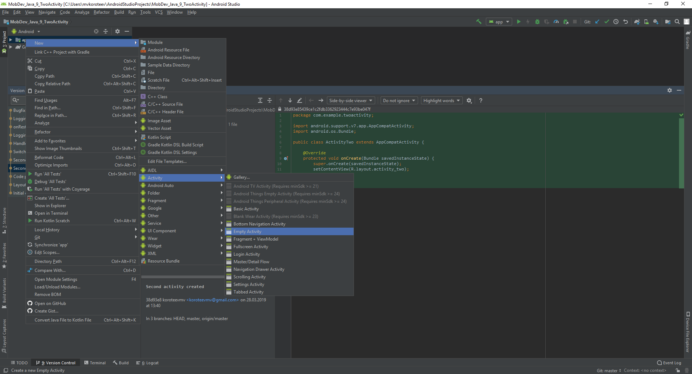
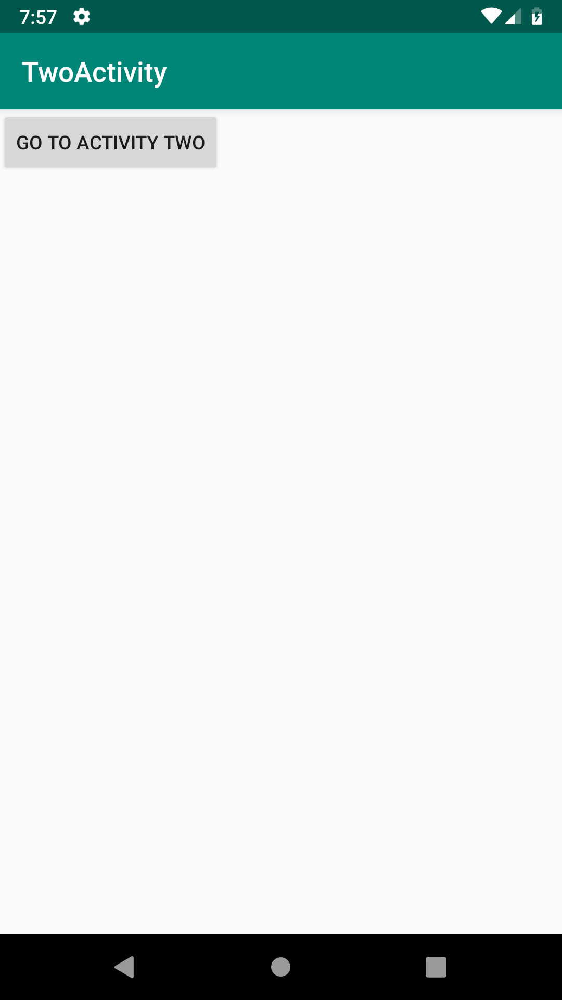
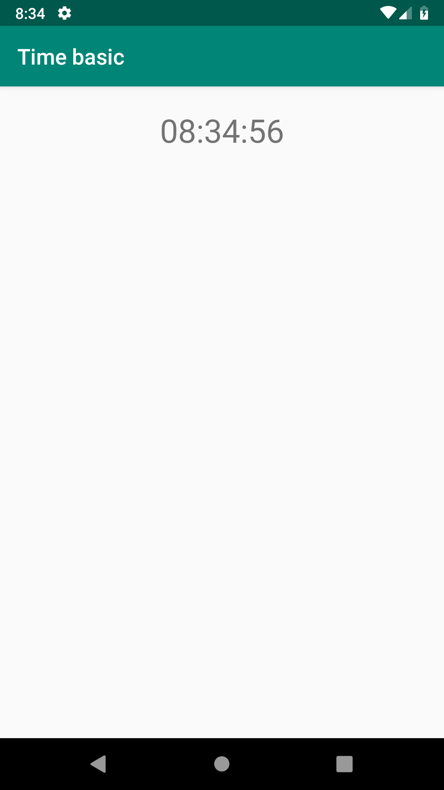
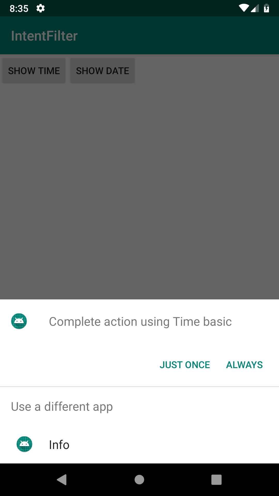
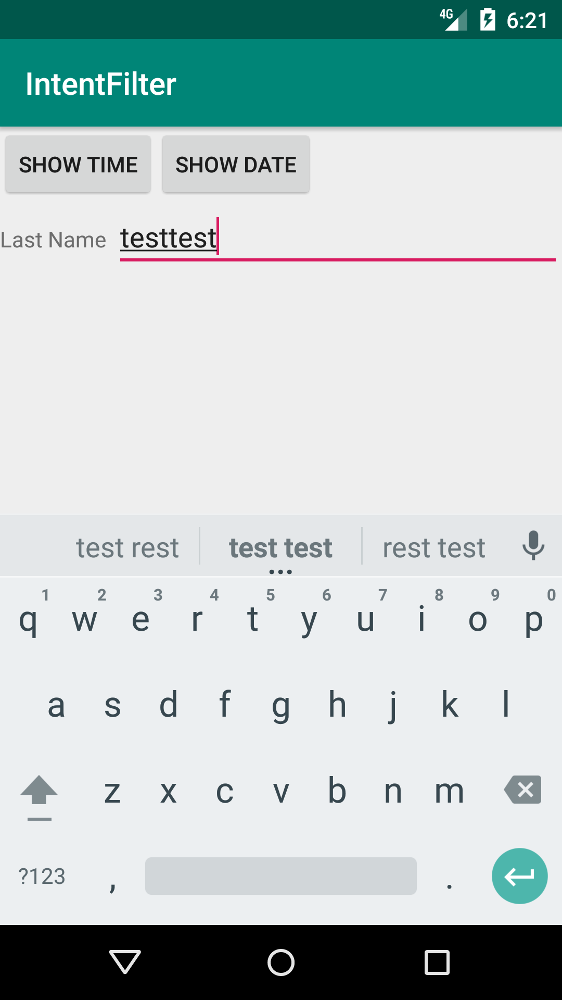
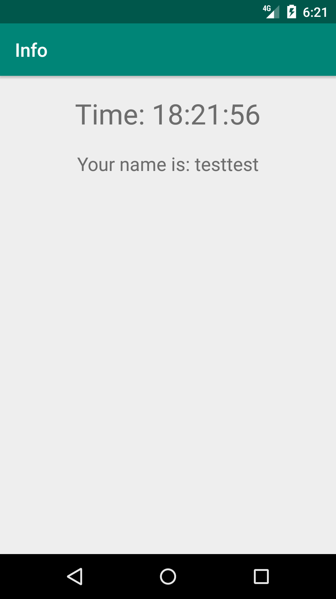
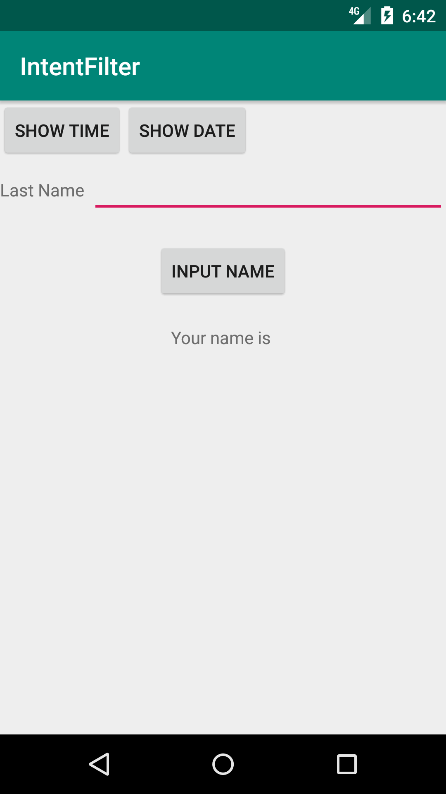
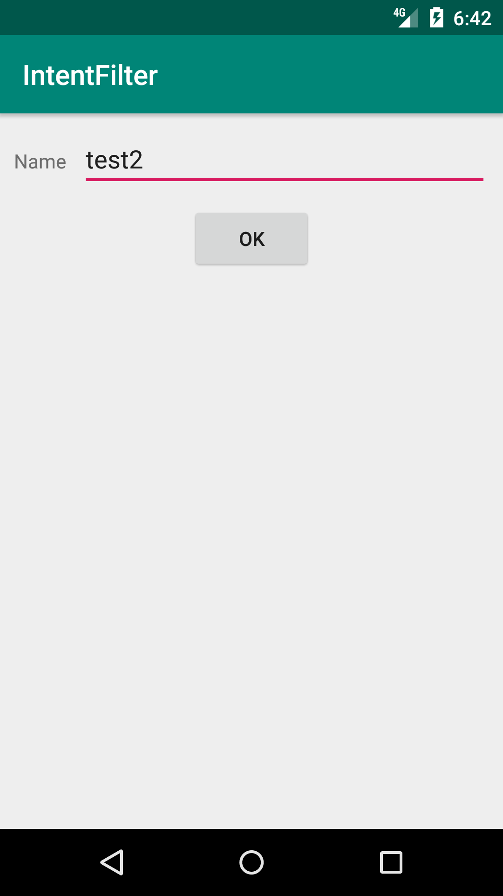

# Mobile-development


## Практика студентов Финансового университета


# Java Android Studio
__________________________________________

# [Методичка](http://koroteev.site/md/)


- # Создание второго окна приложения
Цель работы

    Ознакомиться со способом создания и запуска второго окна в составе мобильного приложения. 
## Методические указания
Создадим новый проект. По умолчанию, новый проект состоит из одной активити с пустым расположением. 

Во-первых, создадим расположение, состоящее из одной кнопки. При нажатии на эту кнопку мы будем переходить во второе окно приложения:

```xml
<?xml version="1.0" encoding="utf-8"?>
<LinearLayout
   xmlns:android="http://schemas.android.com/apk/res/android"
   android:orientation="vertical"
   android:layout_width="fill_parent"
   android:layout_height="fill_parent">
   <Button
       android:layout_width="wrap_content"
       android:layout_height="wrap_content"
       android:text="Go to Activity Two"
       android:id="@+id/btnActTwo">
   </Button>
</LinearLayout>
```

Создадим для этой кнопки обработчик нажатия, пока пустой:

```java
@Override
public void onClick(View v) {
   switch (v.getId()) {
       case R.id.btnActTwo:
           // TODO Call second activity
           break;
       default:
           break;
   }
}
```

Теперь попробуем добавить новую активити. Самый простой способ это сделать - щелкнуть на проекте в панели навигатора правой кнопкой и выбрать пункт меню 

*New -> Activity -> Empty Activity,*

как показано на рисунке:



Мы должны увидеть окно добавления нового окна (активити), которое весьма похоже на окно, появляющееся при создании нового проекта. Здесь мы можем ввести имя нашего нового компонента, имя файла с расположением элементов и некоторые другие параметры. Преимуществом этого способа создания новой активити является то, что студия автоматизирует весь процесс за нас, создает все необходимые файлы и вносит нужные дополнения в файл манифеста. 


При нажатии на кнопку Finish мы должны увидеть два новых файла в нашем проекте - один с программным кодом и один с XML расположением. Обратите внимание, что оба окна приложения, несмотря на то, что являются независимыми компонентами приложения, существуют в одном адресном пространстве. 

Обратите внимание на то, что в файле манифеста появилась новая строка:

``<activity android:name=".ActivityTwo"></activity>``

То есть, наша новая активити полноценно зарегистрирована в нашем приложении.
Теперь для иллюстрации создадим расположение второго окна. Создадим в нем одно текстовое поле:

```xml
<LinearLayout
   xmlns:android="http://schemas.android.com/apk/res/android"
   android:orientation="vertical"
   android:layout_width="match_parent"
   android:layout_height="match_parent">
   <TextView
       android:id="@+id/textView1"
       android:layout_width="wrap_content"
       android:layout_height="wrap_content"
       android:text="This is Activity Two">
   </TextView>
</LinearLayout>
```

Теперь для организации перехода в новое окно нам осталось дописать в обработчике тапа по кнопке создание интента и запуск активити. В данном случае воспользуемся явным вызовом - передадим в интент конкретное название только что созданной активити:

```java
public void onClick(View v) {
   switch (v.getId()) {
       case R.id.btnActTwo:
           Intent intent = new Intent(this, ActivityTwo.class);
           startActivity(intent);
           break;
       default:
           break;
   }
}
```

Регистрацию обработчика тапа оставляем на самостоятельную реализацию.

Теперь при запуске приложения мы должны иметь возможность перейти в новое окно по тапе на кнопке. Обратите внимание, что для возврата к предыдущему окну нам можно воспользоваться стандартной кнопкой Назад. 
Для того, чтобы лучше понять жизненный цикл активности давайте добавим в наше основное окно реализации некоторых стандартных методов жизненного цикла:

```java
@Override
protected void onStart() {
   super.onStart();
   Log.d(TAG, "MainActivity: onStart()");
}

@Override
protected void onResume() {
   super.onResume();
   Log.d(TAG, "MainActivity: onResume()");
}

@Override
protected void onPause() {
   super.onPause();
   Log.d(TAG, "MainActivity: onPause()");
}

@Override
protected void onStop() {
   super.onStop();
   Log.d(TAG, "MainActivity: onStop()");
}

@Override
protected void onDestroy() {
   super.onDestroy();
   Log.d(TAG, "MainActivity: onDestroy()");
}

@Override
   protected void onRestart() {
       super.onRestart();
       Log.d(TAG, "MainActivity: onRestart()");
}
```

Эти методы, как Вы помните, вызываются автоматически системой при смене состояния активности, например, при приостановке активности. В данном случае, мы в каждом из этих методов пишем в поток логов специальное сообщение, поясняющее, какой метод когда был вызван. Первый аргумент, это просто метка, позволяющая в общем потоке методов выделить созданные нами сообщения:

``final String TAG = "States";``

Так как метод onCreate также относится к методам жизненного цикла, добавим соответствующее сообщение и в него:

``Log.d(TAG, "MainActivity: onCreate()");``

Для более полной информации можете самостоятельно добавить соответствующие сообщения во вторую активити.
Теперь запустим наше приложение и убедимся, что все работает, как нужно:




Мы можем посмотреть диагностические сообщения, которые посылает и сама система, и студия, и непосредственно наше приложение в окне Logcat студии. Для удобства отфильтруем сообщения по нашей метке States:


Теперь вы знаете, как создавать и вызывать новое окно в составе вашего приложения. 

## Контрольные вопросы
Зачем делить приложение на несколько окно? Почему нельзя использовать разные расположения?

Что такое интент и зачем он нужен?

Как вызвать определенное окно своего приложение? А другого?

Что такое таск? Почему при перемещении между окнами работает кнопка “Назад”?
## Дополнительные задания
Создайте приложение, состоящее из четырех активностей и реализуйте переходы между ними. 

Реализуйте переходы между активностями используя меню приложения. Меню должно быть описано в XML файле и быть общим для всех четырех активностей. 

(*) Реализуйте передачу данных между активностями. В первом окне создайте текстовое поле для ввода имени и кнопку. При тапе на кнопку должно открываться второе окно, в котором отображается имя, введенное пользователем.

- # Практика: Жизненный цикл активности	

	Видео	https://www.youtube.com/watch?v=SnlEPgtjSf4

- # Фильтры намерений
Цель работы

    Научиться использовать неявный вызов активности и создавать свои фильтры намерений (intent filters) для запуска независимых компонентов приложения.
## Методические указания
В данной работе мы будем создавать несколько активностей и налаживать между ними сложное взаимодействие.

Создадим новый проект. В файле расположения основного (и пока единственного окна) создадим две кнопки. При нажатии на первую мы хотим, чтобы открывалось окно, отображающее текущее время, а при тапе на вторую - окно, выводящее текущую дату. 

```xml
<LinearLayout
   xmlns:android="http://schemas.android.com/apk/res/android"
   android:layout_width="fill_parent"
   android:layout_height="fill_parent"
   android:orientation="horizontal">
   <Button
       android:layout_width="wrap_content"
       android:layout_height="wrap_content"
       android:id="@+id/btnTime"
       android:text="Show time">
   </Button>
   <Button
       android:layout_width="wrap_content"
       android:layout_height="wrap_content"
       android:id="@+id/btnDate"
       android:text="Show date">
   </Button>
</LinearLayout>
```

В основном классе создадим обработчик тапа по этим кнопкам. Обратите внимание, что мы создаем новый интент, однако не указываем конкретное имя класса активности, как на прошлой работе, а указываем только некую строчку. Эта строчка задает действие, которое мы хотим выполнить. По идее, в системе может быть несколько активностей, которые умеют делать одно и то же. В таком случае, система найдет все такие компоненты и предоставит пользователю выбор. 
```java
public void onClick(View v) {
   Intent intent;


   switch(v.getId()) {
       case R.id.btnTime:
           intent = new Intent("ru.startandroid.intent.action.showtime");
           startActivity(intent);
           break;
       case R.id.btnDate:
           intent = new Intent("ru.startandroid.intent.action.showdate");
           startActivity(intent);
           break;
   }
}
```
Создадим вторую активность. Это будет окно, отображающее текущее время. Пока это пустое окно:
```java
package com.example.intentfilter;


import android.support.v7.app.AppCompatActivity;
import android.os.Bundle;


public class ActivityTime extends AppCompatActivity {


   @Override
   protected void onCreate(Bundle savedInstanceState) {
       super.onCreate(savedInstanceState);
       setContentView(R.layout.activity_time);
   }
}
```
И третью, отвечающую за отображение даты, тоже пустую:
```java
package com.example.intentfilter;


import android.support.v7.app.AppCompatActivity;
import android.os.Bundle;


public class ActivityDate extends AppCompatActivity {


   @Override
   protected void onCreate(Bundle savedInstanceState) {
       super.onCreate(savedInstanceState);
       setContentView(R.layout.activity_date);
   }
}
```
Во второй активности реализуем отображение текущей даты. Обратите внимание на работу со стандартными методами и классами Java для работы с датой и временем. Советуем обратиться к документации для более глубокого изучения стандартной библиотеки Java. 

    SimpleDateFormat sdf = new SimpleDateFormat("HH:mm:ss");
    String time = sdf.format(new Date(System.currentTimeMillis()));


    TextView tvTime = (TextView) findViewById(R.id.tvTime);
    tvTime.setText(time);

Модифицируем файл манифеста. Здесь мы сразу сделаем несколько вещей. Во-первых, мы добавили атрибут label нашей активности. Это нужно для того, чтобы в окне выбора активности она имела приятное и понятное название. Во-вторых, мы создали новый элемент - это, собственно и есть фильтр. Он задает, какие действия умеет делать наша активность, то есть на какие неявные вызовы она может откликаться. Добавим необходимые атрибуты и впишем название действия также, как мы его обозначили в программном файле ранее:
```xml
<activity android:name=".ActivityTime" android:label="Time basic">
   <intent-filter>
       <action android:name="com.example.intent.action.showtime" />
       <category android:name="android.intent.category.DEFAULT" />
   </intent-filter>
</activity>
```

Самостоятельно модифицируйте третью активность таким образом, чтобы она откликалась на второе действие и выводила на экран такую дату в похожем кратком формате. Проверьте, что при тапе на обоих кнопках запускаются соответствующие активности.

Создадим еще одну активность. Эта четвертая активность будет откликаться на оба действия. На этом примере мы продемонстрируем, как можно проверять значение интента, вызвавшего данную активность.
```java
package com.example.intentfilter;


import android.support.v7.app.AppCompatActivity;
import android.os.Bundle;


public class Info extends AppCompatActivity {


   @Override
   protected void onCreate(Bundle savedInstanceState) {
       super.onCreate(savedInstanceState);
       setContentView(R.layout.activity_info);
   }
}
```

Добавим фильтр в манифест. В данном случае, мы добавим оба действия в один фильтр:

```java
<activity android:name=".Info" android:label="Info">
   <intent-filter>
       <action android:name="com.example.intent.action.showdate" />
       <action android:name="com.example.intent.action.showtime" />


       <category android:name="android.intent.category.DEFAULT" />
   </intent-filter>
</activity>
```

Добавляем различные действия для разных интентов. Для этого мы получим объект-интент, вызвавший данную активность с помощью специального метода и проверим его свойство Action:

```java
// получаем Intent, который вызывал это Activity
Intent intent = getIntent();
// читаем из него action
String action = intent.getAction();


String format = "", textInfo = "";


// в зависимости от action заполняем переменные
if (action.equals("com.example.intent.action.showtime")) {
   format = "HH:mm:ss";
   textInfo = "Time: ";
}
else if (action.equals("com.example.intent.action.showdate")) {
   format = "dd.MM.yyyy";
   textInfo = "Date: ";
}


// в зависимости от содержимого переменной format
// получаем дату или время в переменную datetime
SimpleDateFormat sdf = new SimpleDateFormat(format);
String datetime = sdf.format(new Date(System.currentTimeMillis()));


TextView tvDate = (TextView) findViewById(R.id.tvInfo);
tvDate.setText(textInfo + datetime);
```

Теперь все готово для запуска приложения. На основном экране мы должны увидеть две кнопки:


При нажатии на одну из них нам предоставляется выбор, какую активность запустить для выполнения соответствующего действия:




При повторном выбор того же действия система запомнит наш выбор:




Таким образом можно использовать действия для запуска различных активностей. В данной работе мы определили собственное действие, существующее только в нашем приложении. Однако, точно таким же образом можно использовать стандартные действия, определенные самой системой для выполнения распространенных задач. 

Самостоятельно изучите их.
## Передача информации в интент
Теперь потренируемся передавать информацию в запущенный по интенту компонент. Для этого создадим поле для текстового ввода в схеме главного окна:
```java
<LinearLayout
   android:layout_width="match_parent"
   android:layout_height="wrap_content">

   <TextView
       android:id="@+id/textView2"
       android:layout_width="wrap_content"
       android:layout_height="wrap_content"
       android:text="Last Name">
   </TextView>

   <EditText
       android:id="@+id/etLName"
       android:layout_width="match_parent"
       android:layout_height="wrap_content"
       android:layout_marginLeft="5dp">
   </EditText>
</LinearLayout>
```

В коде главной активности добавим необходимый код для извлечения строки из поля ввода. Теперь добавим вызов метода интента после его создания, но до старта активности по этому интенту:
``intent.putExtra("lname", etLName.getText().toString());``
Эта инструкция добавит в структуру данных интента пользовательской текстовое поле с именем "lname" и значением из нашего текстового поля. Таких полей можно добавлять сколько угодно. 

Теперь воспользуемся переданной информацией во второй активности. Создадим для нее текстовое поле:
```java
<TextView
   android:id="@+id/tvView"
   android:layout_width="wrap_content"
   android:layout_height="wrap_content"
   android:layout_gravity="center_horizontal"
   android:layout_marginTop="20dp"
   android:text="TextView"
   android:textSize="20sp">
</TextView>
```

И запишем в него информацию, извлеченную из интента:

    String lName = intent.getStringExtra("lname");
    tvView.setText("Your name is: " + lName);

Общая схема работы нашего приложения теперь выглядит так. Обращаем внимание, что мы модифицировали только активность “Info”, две остальные не получают из интена дополнительных полей (хотя они туда все равно передаются). 





- # Возвращение результатов из интента
Часто требуется запустить активность для того, чтобы получить из нее какой-либо результат. Для этого изучим механизм возврата значения из активности. 
Добавим в главное окно надпись и кнопку, по нажатию на которую мы будем переходить в другую активность и вводить текст, а при возврате в главную активность этот текст будет отображаться. 
```xml
<LinearLayout
   xmlns:android="http://schemas.android.com/apk/res/android"
   android:layout_width="fill_parent"
   android:layout_height="fill_parent"
   android:orientation="vertical">
   <Button
       android:id="@+id/btnName"
       android:layout_width="wrap_content"
       android:layout_height="wrap_content"
       android:layout_gravity="center_horizontal"
       android:layout_margin="20dp"
       android:text="Input name">
   </Button>

   <TextView
       android:id="@+id/tvName"
       android:layout_width="wrap_content"
       android:layout_height="wrap_content"
       android:layout_gravity="center_horizontal"
       android:text="Your name is ">
   </TextView>
</LinearLayout>
```

В коде главной активности добавим в обработчик события код вызова новой активности. Обратите внимание, что мы вызываем активность при помощи другого метода.

    intent = new Intent(this, NameActivity.class);
    startActivityForResult(intent, 1);
    break;


Теперь создадим вторую активность и расположим в ней необходимые элементы для удобного ввода текста:

```xml
<LinearLayout
   xmlns:android="http://schemas.android.com/apk/res/android"
   android:layout_width="match_parent"
   android:layout_height="match_parent"
   android:orientation="vertical">

   <LinearLayout
       android:id="@+id/linearLayout1"
       android:layout_width="match_parent"
       android:layout_height="wrap_content"
       android:layout_margin="10dp">

       <TextView
           android:id="@+id/textView1"
           android:layout_width="wrap_content"
           android:layout_height="wrap_content"
           android:text="Name">
       </TextView>

       <EditText
           android:id="@+id/etName"
           android:layout_width="wrap_content"
           android:layout_height="wrap_content"
           android:layout_marginLeft="10dp"
           android:layout_weight="1">
           <requestFocus>
           </requestFocus>
       </EditText>

   </LinearLayout>
   <Button
       android:id="@+id/btnOK"
       android:layout_width="wrap_content"
       android:layout_height="wrap_content"
       android:layout_gravity="center_horizontal"
       android:text="OK">
   </Button>
</LinearLayout>
```

В коде главной активности создадим обработчик нажатия на кнопку. В нем мы создаем интент, в который поместим возвращаемую информацию. Обратите внимание на вызов 
метода finish(). 

```java
@Override
public void onClick(View v) {
   Intent intent = new Intent();
   intent.putExtra("name", etName.getText().toString());
   setResult(RESULT_OK, intent);
   finish();
}
```

Теперь возвращаемся в главную активность. Здесь мы должны определить метод, обрабатывающий обратный интент:

```java
@Override
protected void onActivityResult(int requestCode, int resultCode, Intent data) {
   if (data == null) {return;}
   String name = data.getStringExtra("name");
   tvName.setText("Your name is " + name);
}
```

Проверим работоспособность нашего приложения:






## Контрольные вопросы
Какие существуют соглашения в порядке наименования действий?

Как передать информацию в активность используя неявный вызов?

Какие еще параметры можно задавать при создании неявного интента?

Зачем нужна категория в интент-фильтрах? Какие существуют категории?

Зачем нужен элемент  <requestFocus>?

Зачем нужны аргументы requestCode и resultCode в обратном интенте?

## Дополнительные задания
Создайте приложение, на главном окне которого будет расположено поле ввода текста и при нажатии на кнопку “перейти” будет запускаться браузер по введенному пользователем адресу.

Создайте приложение, отвечающее на какое-либо стандартное системное действие. Проверьте его работоспособность.

Создайте приложение, которое выводит текстовую надпись и предлагает выбрать цвет и выравнивание надписи. Выбор должен производиться в двух разных активностях. При возврате в основную активность форматирование надписи должно меняться. 

(*) Создайте приложение, запускающее приложение камеры. Когда пользователь делает снимок, он должен вернуться в наше приложение, и оно должно отобразить его в виде миниатюры на экране.

- # Практика: Возврат результата	
	Видео		https://www.youtube.com/watch?v=fVqwsoTCoUU
- # Практика: Использование системных активностей
	Видео		https://www.youtube.com/watch?v=EK1m0O0UEQw
- # Практика: Работа с действием Send		
    Видео	https://www.youtube.com/watch?v=xUCXJmnBToM

  <iframe width="560" height="315"
src="https://www.youtube.com/watch?v=xUCXJmnBToM" 
frameborder="0" 
allow="accelerometer; autoplay; encrypted-media; gyroscope; picture-in-picture" 
allowfullscreen></iframe>

Работа с графическими элементами
Цель работы
Освоить работу с базовыми визуальными элементами Android Studio и
способы организации архитектуры приложения на Android.
Задание
На основе лабораторных работ «MD1.1 Основные элементы» и «MD2.2
Фильтры намерений» реализуйте приложение «Список дел», состоящее из
нескольких экранов. На главном экране реализована навигация по
существующим категориям. При переходе на каждую категорию
реализовать возможность добавления новых дел.
При оформлении приложения не оставляйте стандартного оформления,
поменяйте цвета навигации.
Также поменяйте иконку приложения.
Создать иконку можно в Figma (512 х 512 px): https://www.figma.com/

Для того чтобы добавить своё изображение в проект, в
программе Android Studio, в каталоге Вашего проекта, найдите
путь: app &gt; src &gt; res и вызовите контекстное меню (правой кнопкой
мыши):

