# Mobile-development


## <div style="text-align: right">Практика студентов Финансового университета</div>


# Работа с активностями
__________________________________________

# [Методичка](http://koroteev.site/md/)


- #  Лекция: Жизненный цикл активности, интенты			

[Слайды](https://docs.google.com/presentation/d/1hCST-D89fr1NoRsR60hoWanlT_UWQI-qSNzcUaWCGu0/edit?usp=sharing)	
- # Практика: Создание обработчика событий		

[Видео](https://www.youtube.com/watch?v=TObESO3SZR4)	
- # Практика: Обработка нескольких событий		

[Видео](https://www.youtube.com/watch?v=Rr8DOanMPj8)

- # Практика: Кликер
Цель работы

    Познакомиться с основными элементами управления приложения и научиться их использовать согласно логике приложения.
## Задания для выполнения
Создайте простое приложение-кликер. 

Главное и единственное окно приложения должно демонстрировать кнопку с надписью “Нажми меня” и надпись “Вы нажали кнопку 0 раз”. 

При каждом нажатии на кнопку, надпись соответствующим образом изменяется. 

## Методические указания
Создадим новый проект так же, как на прошлой работе. 
Назовем его clicker.

Откроем XML-файл с активностью. Добавим текстовое поле:

```java
<TextView
   android:id="@+id/mainTxt"
   android:layout_width="wrap_content"
   android:layout_height="wrap_content"
   android:text="Кликов: 0"
```

Под ним добавим кнопку:

```java
<Button
   android:id="@+id/main_btn"
   android:layout_width="wrap_content"
   android:layout_height="wrap_content"
   android:text="@string/click_me"/>
```

Перейдем в файл с кодом активности. Для начала введем переменные для наших элементов управления:

    TextView mainText;
    Button mainBtn;

Еще на понадобится переменная, содержащая значение количества тапов по кнопке. Она может быть целого или длинного типа. 
``private long score = 0;``

Эти переменные будут являться членами класса. 

Затем в методе при загрузке приложения найдем по идентификатору ссылки на соответствующие элементы управления:

```
mainText = (TextView) findViewById(R.id.mainTxt);
mainBtn = (Button) findViewById(R.id.main_btn);
```

Теперь создадим обработчик события нажатия на кнопку. В этой работе мы попробуем создать новый класс для обработки события. Это более правильный подход, чтобы не загромождать главный класс активности всеми возможными событиями приложения. 
В Java можно создавать класс сразу при его объявлении по месту, объединив объявление класса с вызовом конструктора:

```
View.OnClickListener clickListener = new View.OnClickListener() {
   @Override
   public void onClick(View v) {
   }
};
```

Обратите внимание на точку с запятой в конце объявления класса - это все-таки оператор присваивания. 

Таким образом, мы создали анонимный класс-потомок класса ``View.OnClickListener()`` с одним переопределенным методом - ``onClick() ``и сразу же создали экземпляр этого класса в переменную clickListener. Это полезно, если Вы планируете использовать определение класса только один раз.


Метод ``onClick()`` должен будет вызываться при нажатии на кнопку. В определении этого метода нам нужно произвести следующие действия:

Увеличиваем значение счетчика нажатий:

``score ++;``

Составляем нужную строку:
``String s = "Кликов: " + score;``

Выводим эту строку в текстовое поле:
``mainText.setText(s.toCharArray(),0, s.length());``

Теперь нам осталось только назначить обработчик события нужному нам элементу управления:
``mainBtn.setOnClickListener(clickListener);``

Запустим наше приложение. Мы должны увидеть работающую кнопку и счетчик нажатий:


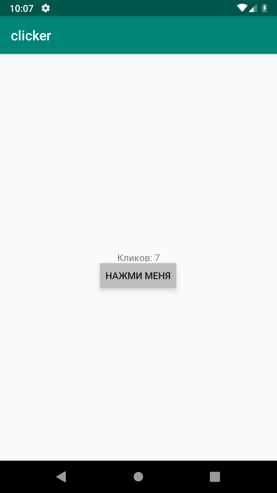


При желании Вы можете изменить оформление или позиционирование этих элементов.

## Дополнительные задания

Добавьте в приложение кнопку, которая наоборот, уменьшает счетчик нажатий.

Добавьте кнопку, сбрасывающую счетчик.
Модифицируйте надпись так, чтобы она гласила “Кнопка нажата N раз”. Реализуйте правильное склонение слова “раз”.

Используйте вместо кнопки произвольную картинку.

(*) Создайте приложение-калькулятор. Приложение должно предоставлять пользователю возможность вводить числа тапами по кнопкам и с клавиатуры.


- # Практика: Угадай число
Цель работы

    Разработка простого приложения, помогающего понять структуру приложения, освоить основные операторы, привыкнуть к среде разработки.

## Задания для выполнения


Наше будущее приложение  - "Угадай число". 
Суть приложения в том, что программа случайным образом "загадывает" число от 0 до 100, а пользователь должен угадать это число. 

При каждом вводе числа, программа сообщает пользователю результат: введенное число больше загаданного, меньше или же "Ура, победа!" число угадано.


Разрабатываемое приложение выполняет свои функции только когда видимо на экране, когда оно не видимо его работа приостанавливается, т. е. имеем дело с приложением переднего плана. Для выполнения всей работы достаточно определить одну активность в приложении, фоновые процессы не предусмотрены.

Далее в работе рассмотрим простейшие элементы интерфейса пользователя и добавим их в приложение, а также рассмотрим вопросы, связанные непосредственно с программированием: научимся обрабатывать события, возникающие при взаимодействии приложения с пользователем; реализуем логику проверки числа на совпадение с загаданным.

- ## Создание приложения и изучение его структуры

Создайте новый проект. 


В процессе создания проекта, среда разработки подготавливает необходимые папки и файлы. Полный иерархический список обязательных элементов проекта можно увидеть на вкладке Package Explorer

В настоящее время нас будет интересовать назначение нескольких файлов и папок.
### Рассмотрим папки:


•	папка src - содержит файлы с исходным кодом на языке Java. Именно в этой папке размещаются все классы, создаваемые в процессе разработки приложения. Сейчас в этой папке в пакете com.example.projectn размещается единственный класс MainActivity.java. Этот класс определяет главную и единственную активность в этом приложении.
- 1: Имя пакету присваивается в процессе создания приложения в поле Package Name, использовать com.example не рекомендуется, т. к. пакет с таким именем нельзя загрузить в Google Play. Часто рекомендуют использовать в качестве имени пакета название сайта программиста, записанное в обратном порядке, можно просто использовать свои имя и фамилию. Последнее слово в имени пакета формируется автоматически и совпадает с именем проекта.
- 2: Имя файлу присваивается в процессе создания приложения на этапе настройки активности. Имя определяется в поле Activity Name.
- 3: Package Explorer отображает структуру папок, которая создается в каталоге, выбранном в качестве рабочего (Workspace) при запуске Eclipse. Например, рабочий каталог называется workspace, в нем для нашего проекта появилась папка с именем проет, в ней есть папка src, в ней com, в ней example, в ней projectn (заметьте, что название пакета распалось на три папки, каждое слово, отделенное точкой определило новую папку). И уже в папке projectn находится файл MainActivity.java и будут размещаться другие java-файлы проекта.

•	папка res - содержит структуру папок ресурсов приложения, рассмотрим некоторые из них:

-	layout - в данной папке содержатся xml-файлы, которые описывают внешний вид форм и их элементов, пока там находится только activity_main.xml;
-	values - содержит XML файлы, которые определяют простые значения, таких ресурсов как, строки, числа, цвета, темы, стили, которые можно использовать в данном проекте;
-	menu - содержит XML файлы, которые определяют все меню приложения.
Подробно с описанием всех элементов файла манифеста приложения можно познакомиться по ссылке:
http://developer.android.com/guide/topics/manifest/manifest-intro.html.

Чаще всего, при создании приложения приходится иметь дело с папками src, res/layout и res/values, т.к. там находятся основные файлы проекта.

## Настройка интерфейса приложения
Пришло время задуматься о внешнем виде приложения. Для начала необходимо определить какие элементы графического интерфейса нам нужны, как эти элементы будут располагаться на форме и каким образом будет реализовано взаимодействие с пользователем.

Так как приложение очень простое, то и интерфейс особой сложностью отличаться не будет. Нам потребуется поле для ввода чисел (TextEdit), текстовая метка для вывода информации (TextView) и кнопка для подтверждения введенного числа (Button). Располагать элементы интерфейса будем друг под другом, сверху информационная часть, ниже поле ввода, кнопку разместим в самом низу приложения. Взаимодействие приложения с пользователем организуется очень просто: пользователь вводит число в поле для ввода и нажимает кнопку, читает результат в информационном поле и, либо радуется победе, либо вводит новое число.

Если пользователь вводит правильное число, то приложение предлагает ему сыграть снова при этом кнопка будет играть роль подтверждения, а в информационное поле будет выведено приглашение к повторной игре.

Схематично интерфейс приложения изображен на рисунке:


Нам необходимо добавить на форму три элемента: 
    
    информационное поле (TextView), 
    поле ввода (TextEdit) 
    и кнопку (Button).

Android IDE поддерживает два способа для выполнения действий по формированию интерфейса приложения: первый основан на XML-разметке, второй относится к визуальному программированию и позволяет перетаскивать объекты интерфейса и размещать их на форме с помощью мыши. Считается, что визуальный способ подходит для новичков, а более продвинутые разработчики могут писать код вручную, однако чаще всего используется комбинированный подход.

Для формирования интерфейса будем работать с файлом res/layout/activity_main.xml. На рисунке можно увидеть редактор, соответствующий визуальному способу формирования интерфейса, этому режиму соответствует вкладка Graphical Layout.


Зададим табличное расположение компонентов на форме, для этого выберем вкладку Layouts, найдем там TableLayout и добавим его на форму:


Настройка интерфейса, добавление TableLayout

Теперь начнем добавлять элементы интерфейса, будем использовать графический режим правки.

- Во-первых, нам необходимо добавить информационное поле. Для этого на панели =Palette=  найдем поле TextView, перенесем в окно приложения, разместим в первой строке таблицы (TableLayout).

- Во-вторых, нам потребуется поле ввода информации, на вкладке Text найдем текстовое поле Number и разместим во второй строке таблицы.

- В-третьих, вернемся на вкладку Buttons, выберем там элемент Button и добавим в третью строку таблицы. Ненужную четвертую строку таблицы удалим, получим следующий вид приложения.


Интерфейс приложения

После настройки интерфейса можно заглянуть в файл activity_main.xml, в этом файле прописано, что используется TableLayout и дано описание каждой из трех строк. На рисунке можно увидеть, как выглядит такое описание на примере первой строки таблицы.


Фрагмент файла activity_main.xml, описание строки в TableLayout

Теперь необходимо наполнить наши элементы интерфейса смыслом, нам понадобится текст для общения с пользователем, при программировании под Android существует практика разделять ресурсы и код приложения. 

Для хранения любых строк, которые могут понадобиться приложению, используется файл strings.xml. Хранение всех строковых ресурсов в этом файле серьезно облегчает локализацию приложения на другие языки. Этот файл можно найти в Package Explorer в папке res/values. Откроем его и посмотрим, что там есть.


Файл string.xml

Уберем лишние строки и добавим новые.

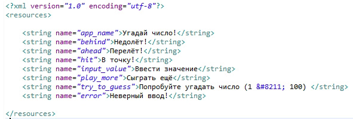

Отредактированный файл string.xml

Данные переменные будут выполнять следующие задачи:

app_name установит "видимое" название приложения;

behind, ahead, hit оповестят пользователя об его успехах в игре;

play_more и try_to_guess установит название кнопки, которое объяснит её функции;

input_value пригласит пользователя к вводу числа;
error сообщит о неверном вводе.

После изменения strings.xml, при переходе на другую вкладку, не забудьте сохранить изменения (самый быстрый способ - нажать Ctrl+S).

Настроим текст в информационном поле. 
Для этого на вкладке Properties в правой части окна выберем элемент textView1 (это и есть наше информационное поле, имеет смысл придумать ему более осмысленное имя). Найдем свойство Text, подставим в него значение строки с именем try_to_guess.

Аналогично можно настроить текст, которым нас будет приветствовать кнопка, только в этом случае надо работать с элементом button1.

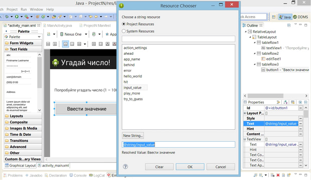

Настройка текста для кнопки button1

Пришло время вспомнить о виртуальном устройстве, если оно работает, уже можно запустить проект и посмотреть, как приложение будет выглядеть на экране устройства, а выглядеть оно может так.


Запуск приложения на виртуальном устройстве

Приложение выглядит довольно просто, но мы на многое и не рассчитывали. 
Главное, что нас интересует, это наличие всех элементов на экране, верный текст в каждом элементе, где он предусмотрен и возможность вводить числа в поле ввода. 

На рисунке видно, что все требования выполнены. 
Приложение есть, его можно запустить на виртуальном или реальном устройстве, но оно ничего не делает. Следующим шагом будет реализация логики приложения, т. е. обработка события нажатия на кнопку, как было прописано в задании.

## Реализация логики приложения

Приступим непосредственно к программированию, работать будем с файлом src/com.example.projectn/MainActivity.java. Найдем этот файл в Package Explorer, откроем и начнем редактировать.


Рис. 4.13. Файл MainActivity.java в Package Explorer
Пока файл выглядит следующим образом.

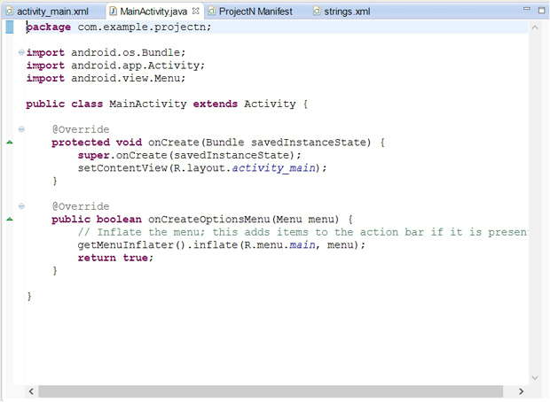

Файл MainActivity.java после создания приложения

Можно заметить, что класс MainActivity является наследником класса Activity и в нем уже реализован метод onCreate(), который запускается при первоначальном создании активности, нам потребуется его дополнить, но об этом чуть позже.

Мы предполагаем программно менять информацию в поле TextView, получать значение из поля EditText и обрабатывать события нажатия на кнопку Button, поэтому необходимо объявить соответствующие переменные, как поля класса MainActivity:

    TextView tvInfo;
    EditText etInput;
    Button bControl;	

Чтобы не было ошибок, необходимо импортировать пакет android.widget, который содержит все элементы графического интерфейса:

    import android.widget.*;	

На самом деле среда разработки подскажет, что делать.

Теперь необходимо связать эти переменные с элементами интерфейса, уже добавленными нами в activity_main.xml, сделать это необходимо в методе onCreate(), а для получения уже созданного элемента интерфейса воспользуемся методом findViewById().
 Итак в метод onCreate() добавим следующие строки:

    tvInfo = (TextView)findViewById(R.id.textView1);
    etInput = (EditText)findViewById(R.id.editText1);
    bControl = (Button)findViewById(R.id.button1);	

Метод findViewById() возвращает объект класса View, который является общим предком для всех компонентов пользовательского интерфейса, для того чтобы избежать возможных ошибок в скобках перед вызовом метода указываем до какого конкретно компонента необходимо сузить возможности объекта View.

Пришло время выполнить обработку нажатия на кнопку. Вернемся к файлу activity_main.xml в графический режим редактирования, выберем элемент Button и на вкладке со свойствами элемента найдем свойство On Click и запишем в него onClick - имя метода, который будет обрабатывать нажатие на кнопку. 


Настройка свойства On Click для кнопки
Эти же действия можно выполнить в фале activity_main.xml, достаточно дописать выделенную строку:


Для настройки свойств элементов интерфейса достаточно использовать любой способ: графический или редактирование XML файла.

Вернемся в файл MainActivity.java, в класс активности необходимо добавить метод:

    public void onClick(View v){...}	

Имя метода не обязательно должно быть onClick(), главное, чтобы оно совпадало с именем, указанным в свойстве On Click. В этом методе и будет происходить все наше программирование в этой лабораторной работе.

Нам потребуются две переменные:
целочисленная для хранения загаданного числа (случайное число от 1 до 100);
логическая для хранения состояния закончена игра или нет.
Обе эти переменные имеет смысл объявить как поля класса активности, первоначальные значения присвоить в методе onCreate.

Получить целочисленное значение из поля ввода, можно с помощью следующей конструкции:

    Integer.parseInt(etInput.getText().toString());

изменить значение текста в информационном поле можно с помощью следующей конструкции:

    tvInfo.setText(getResources().getString(R.string.ahead));	

в данном случае в информационном поле появится значение строкового ресурса с именем ahead.

Осталось реализовать логику приложения в методе onClick(). 
Предлагаем написать код этого метода самостоятельно.
## Дополнительные задания
Обработать возможность нажатия кнопки до ввода числа. Необходимо предусмотреть этот вариант и адекватно среагировать.

Обработать возможность ввода пользователем числа вне данного диапазона. Необходимо вывести сообщение пользователю и запросить повторный ввод.

Предусмотреть возможность выхода из приложения.

(*) Реализовать возможность выбора нескольких уровней сложности.


- # Практика: Простой калькулятор		

[Видео](https://www.youtube.com/watch?v=ur63IBa4rwg)


__________________________________________


- # Практика: Создание второго окна приложения
Цель работы

    Ознакомиться со способом создания и запуска второго окна в составе мобильного приложения. 
## Методические указания
Создадим новый проект. По умолчанию, новый проект состоит из одной активити с пустым расположением. 

Во-первых, создадим расположение, состоящее из одной кнопки. При нажатии на эту кнопку мы будем переходить во второе окно приложения:

```xml
<?xml version="1.0" encoding="utf-8"?>
<LinearLayout
   xmlns:android="http://schemas.android.com/apk/res/android"
   android:orientation="vertical"
   android:layout_width="fill_parent"
   android:layout_height="fill_parent">
   <Button
       android:layout_width="wrap_content"
       android:layout_height="wrap_content"
       android:text="Go to Activity Two"
       android:id="@+id/btnActTwo">
   </Button>
</LinearLayout>
```

Создадим для этой кнопки обработчик нажатия, пока пустой:

```java
@Override
public void onClick(View v) {
   switch (v.getId()) {
       case R.id.btnActTwo:
           // TODO Call second activity
           break;
       default:
           break;
   }
}
```

Теперь попробуем добавить новую активити. Самый простой способ это сделать - щелкнуть на проекте в панели навигатора правой кнопкой и выбрать пункт меню 

*New -> Activity -> Empty Activity,*

как показано на рисунке:


Мы должны увидеть окно добавления нового окна (активити), которое весьма похоже на окно, появляющееся при создании нового проекта. Здесь мы можем ввести имя нашего нового компонента, имя файла с расположением элементов и некоторые другие параметры. Преимуществом этого способа создания новой активити является то, что студия автоматизирует весь процесс за нас, создает все необходимые файлы и вносит нужные дополнения в файл манифеста. 

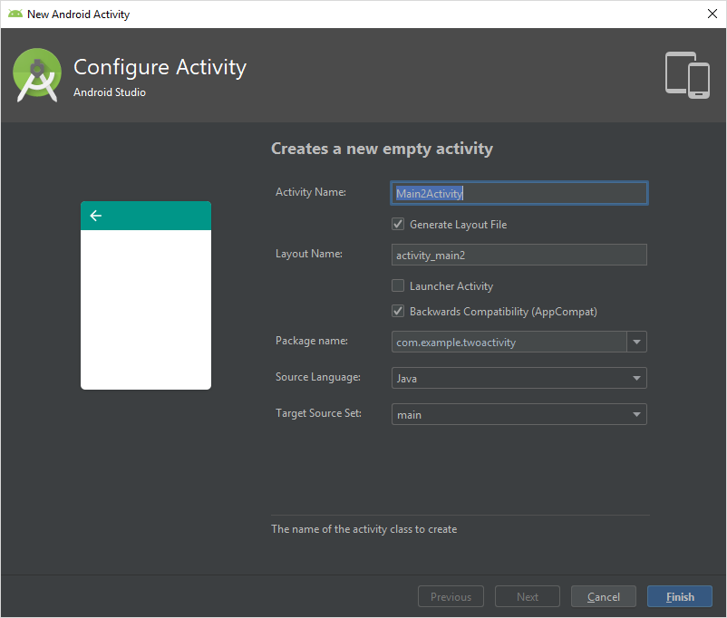

При нажатии на кнопку Finish мы должны увидеть два новых файла в нашем проекте - один с программным кодом и один с XML расположением. Обратите внимание, что оба окна приложения, несмотря на то, что являются независимыми компонентами приложения, существуют в одном адресном пространстве. 

Обратите внимание на то, что в файле манифеста появилась новая строка:

``<activity android:name=".ActivityTwo"></activity>``

То есть, наша новая активити полноценно зарегистрирована в нашем приложении.
Теперь для иллюстрации создадим расположение второго окна. Создадим в нем одно текстовое поле:

```xml
<LinearLayout
   xmlns:android="http://schemas.android.com/apk/res/android"
   android:orientation="vertical"
   android:layout_width="match_parent"
   android:layout_height="match_parent">
   <TextView
       android:id="@+id/textView1"
       android:layout_width="wrap_content"
       android:layout_height="wrap_content"
       android:text="This is Activity Two">
   </TextView>
</LinearLayout>
```

Теперь для организации перехода в новое окно нам осталось дописать в обработчике тапа по кнопке создание интента и запуск активити. В данном случае воспользуемся явным вызовом - передадим в интент конкретное название только что созданной активити:

```java
public void onClick(View v) {
   switch (v.getId()) {
       case R.id.btnActTwo:
           Intent intent = new Intent(this, ActivityTwo.class);
           startActivity(intent);
           break;
       default:
           break;
   }
}
```

Регистрацию обработчика тапа оставляем на самостоятельную реализацию.

Теперь при запуске приложения мы должны иметь возможность перейти в новое окно по тапе на кнопке. Обратите внимание, что для возврата к предыдущему окну нам можно воспользоваться стандартной кнопкой Назад. 
Для того, чтобы лучше понять жизненный цикл активности давайте добавим в наше основное окно реализации некоторых стандартных методов жизненного цикла:

```java
@Override
protected void onStart() {
   super.onStart();
   Log.d(TAG, "MainActivity: onStart()");
}

@Override
protected void onResume() {
   super.onResume();
   Log.d(TAG, "MainActivity: onResume()");
}

@Override
protected void onPause() {
   super.onPause();
   Log.d(TAG, "MainActivity: onPause()");
}

@Override
protected void onStop() {
   super.onStop();
   Log.d(TAG, "MainActivity: onStop()");
}

@Override
protected void onDestroy() {
   super.onDestroy();
   Log.d(TAG, "MainActivity: onDestroy()");
}

@Override
   protected void onRestart() {
       super.onRestart();
       Log.d(TAG, "MainActivity: onRestart()");
}
```

Эти методы, как Вы помните, вызываются автоматически системой при смене состояния активности, например, при приостановке активности. В данном случае, мы в каждом из этих методов пишем в поток логов специальное сообщение, поясняющее, какой метод когда был вызван. Первый аргумент, это просто метка, позволяющая в общем потоке методов выделить созданные нами сообщения:

``final String TAG = "States";``

Так как метод onCreate также относится к методам жизненного цикла, добавим соответствующее сообщение и в него:

``Log.d(TAG, "MainActivity: onCreate()");``

Для более полной информации можете самостоятельно добавить соответствующие сообщения во вторую активити.
Теперь запустим наше приложение и убедимся, что все работает, как нужно:


Мы можем посмотреть диагностические сообщения, которые посылает и сама система, и студия, и непосредственно наше приложение в окне Logcat студии. Для удобства отфильтруем сообщения по нашей метке States:

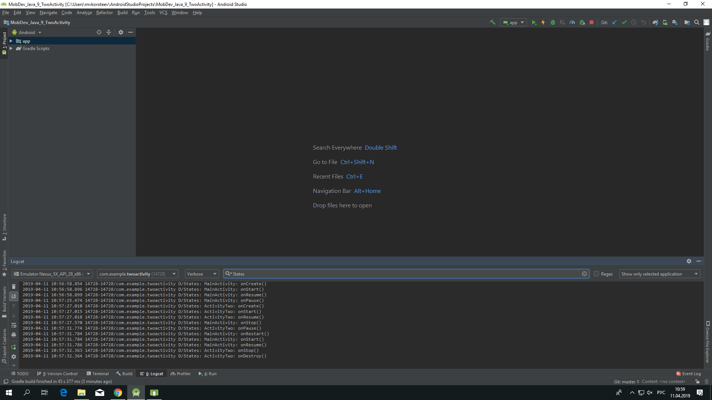

Теперь вы знаете, как создавать и вызывать новое окно в составе вашего приложения. 

## Контрольные вопросы
Зачем делить приложение на несколько окно? Почему нельзя использовать разные расположения?

Что такое интент и зачем он нужен?

Как вызвать определенное окно своего приложение? А другого?

Что такое таск? Почему при перемещении между окнами работает кнопка “Назад”?
## Дополнительные задания
Создайте приложение, состоящее из четырех активностей и реализуйте переходы между ними. 

Реализуйте переходы между активностями используя меню приложения. Меню должно быть описано в XML файле и быть общим для всех четырех активностей. 

(*) Реализуйте передачу данных между активностями. В первом окне создайте текстовое поле для ввода имени и кнопку. При тапе на кнопку должно открываться второе окно, в котором отображается имя, введенное пользователем.

- # Практика: Жизненный цикл активности	

	Видео	https://www.youtube.com/watch?v=SnlEPgtjSf4

- # Фильтры намерений
Цель работы

    Научиться использовать неявный вызов активности и создавать свои фильтры намерений (intent filters) для запуска независимых компонентов приложения.
## Методические указания
В данной работе мы будем создавать несколько активностей и налаживать между ними сложное взаимодействие.

Создадим новый проект. В файле расположения основного (и пока единственного окна) создадим две кнопки. При нажатии на первую мы хотим, чтобы открывалось окно, отображающее текущее время, а при тапе на вторую - окно, выводящее текущую дату. 

```xml
<LinearLayout
   xmlns:android="http://schemas.android.com/apk/res/android"
   android:layout_width="fill_parent"
   android:layout_height="fill_parent"
   android:orientation="horizontal">
   <Button
       android:layout_width="wrap_content"
       android:layout_height="wrap_content"
       android:id="@+id/btnTime"
       android:text="Show time">
   </Button>
   <Button
       android:layout_width="wrap_content"
       android:layout_height="wrap_content"
       android:id="@+id/btnDate"
       android:text="Show date">
   </Button>
</LinearLayout>
```

В основном классе создадим обработчик тапа по этим кнопкам. Обратите внимание, что мы создаем новый интент, однако не указываем конкретное имя класса активности, как на прошлой работе, а указываем только некую строчку. Эта строчка задает действие, которое мы хотим выполнить. По идее, в системе может быть несколько активностей, которые умеют делать одно и то же. В таком случае, система найдет все такие компоненты и предоставит пользователю выбор. 
```java
public void onClick(View v) {
   Intent intent;


   switch(v.getId()) {
       case R.id.btnTime:
           intent = new Intent("ru.startandroid.intent.action.showtime");
           startActivity(intent);
           break;
       case R.id.btnDate:
           intent = new Intent("ru.startandroid.intent.action.showdate");
           startActivity(intent);
           break;
   }
}
```
Создадим вторую активность. Это будет окно, отображающее текущее время. Пока это пустое окно:
```java
package com.example.intentfilter;


import android.support.v7.app.AppCompatActivity;
import android.os.Bundle;


public class ActivityTime extends AppCompatActivity {


   @Override
   protected void onCreate(Bundle savedInstanceState) {
       super.onCreate(savedInstanceState);
       setContentView(R.layout.activity_time);
   }
}
```
И третью, отвечающую за отображение даты, тоже пустую:
```java
package com.example.intentfilter;


import android.support.v7.app.AppCompatActivity;
import android.os.Bundle;


public class ActivityDate extends AppCompatActivity {


   @Override
   protected void onCreate(Bundle savedInstanceState) {
       super.onCreate(savedInstanceState);
       setContentView(R.layout.activity_date);
   }
}
```
Во второй активности реализуем отображение текущей даты. Обратите внимание на работу со стандартными методами и классами Java для работы с датой и временем. Советуем обратиться к документации для более глубокого изучения стандартной библиотеки Java. 

    SimpleDateFormat sdf = new SimpleDateFormat("HH:mm:ss");
    String time = sdf.format(new Date(System.currentTimeMillis()));


    TextView tvTime = (TextView) findViewById(R.id.tvTime);
    tvTime.setText(time);

Модифицируем файл манифеста. Здесь мы сразу сделаем несколько вещей. Во-первых, мы добавили атрибут label нашей активности. Это нужно для того, чтобы в окне выбора активности она имела приятное и понятное название. Во-вторых, мы создали новый элемент - это, собственно и есть фильтр. Он задает, какие действия умеет делать наша активность, то есть на какие неявные вызовы она может откликаться. Добавим необходимые атрибуты и впишем название действия также, как мы его обозначили в программном файле ранее:
```xml
<activity android:name=".ActivityTime" android:label="Time basic">
   <intent-filter>
       <action android:name="com.example.intent.action.showtime" />
       <category android:name="android.intent.category.DEFAULT" />
   </intent-filter>
</activity>
```

Самостоятельно модифицируйте третью активность таким образом, чтобы она откликалась на второе действие и выводила на экран такую дату в похожем кратком формате. Проверьте, что при тапе на обоих кнопках запускаются соответствующие активности.

Создадим еще одну активность. Эта четвертая активность будет откликаться на оба действия. На этом примере мы продемонстрируем, как можно проверять значение интента, вызвавшего данную активность.
```java
package com.example.intentfilter;


import android.support.v7.app.AppCompatActivity;
import android.os.Bundle;


public class Info extends AppCompatActivity {


   @Override
   protected void onCreate(Bundle savedInstanceState) {
       super.onCreate(savedInstanceState);
       setContentView(R.layout.activity_info);
   }
}
```

Добавим фильтр в манифест. В данном случае, мы добавим оба действия в один фильтр:

```java
<activity android:name=".Info" android:label="Info">
   <intent-filter>
       <action android:name="com.example.intent.action.showdate" />
       <action android:name="com.example.intent.action.showtime" />


       <category android:name="android.intent.category.DEFAULT" />
   </intent-filter>
</activity>
```

Добавляем различные действия для разных интентов. Для этого мы получим объект-интент, вызвавший данную активность с помощью специального метода и проверим его свойство Action:

```java
// получаем Intent, который вызывал это Activity
Intent intent = getIntent();
// читаем из него action
String action = intent.getAction();


String format = "", textInfo = "";


// в зависимости от action заполняем переменные
if (action.equals("com.example.intent.action.showtime")) {
   format = "HH:mm:ss";
   textInfo = "Time: ";
}
else if (action.equals("com.example.intent.action.showdate")) {
   format = "dd.MM.yyyy";
   textInfo = "Date: ";
}


// в зависимости от содержимого переменной format
// получаем дату или время в переменную datetime
SimpleDateFormat sdf = new SimpleDateFormat(format);
String datetime = sdf.format(new Date(System.currentTimeMillis()));


TextView tvDate = (TextView) findViewById(R.id.tvInfo);
tvDate.setText(textInfo + datetime);
```

Теперь все готово для запуска приложения. На основном экране мы должны увидеть две кнопки:

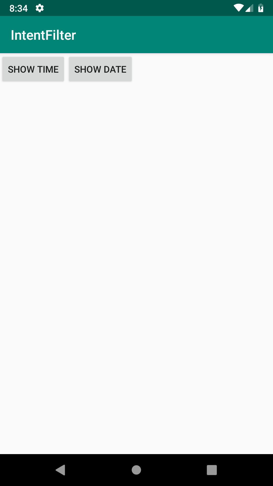

При нажатии на одну из них нам предоставляется выбор, какую активность запустить для выполнения соответствующего действия:


При повторном выбор того же действия система запомнит наш выбор:


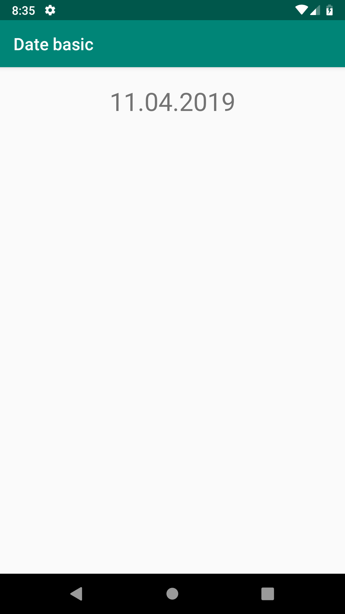

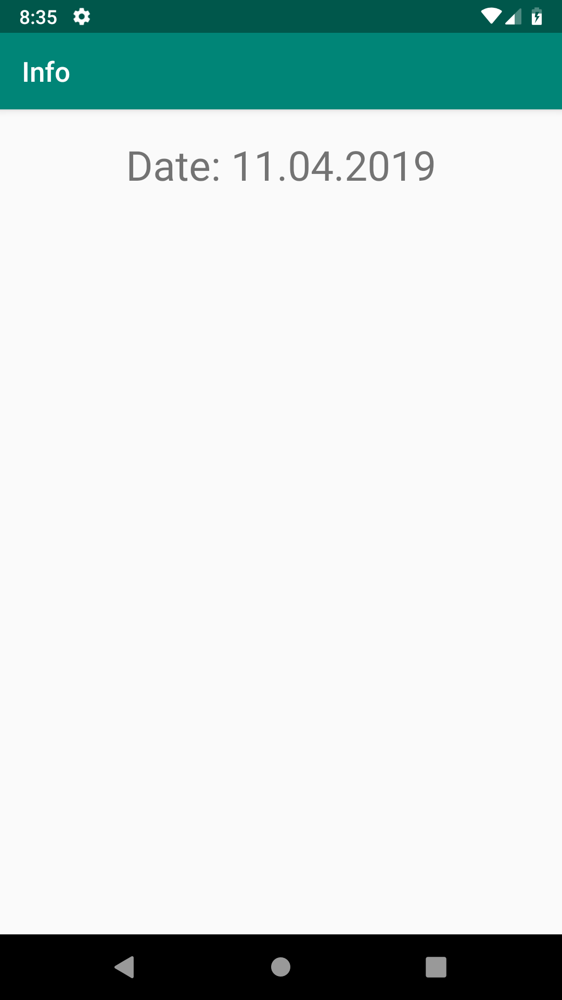

Таким образом можно использовать действия для запуска различных активностей. В данной работе мы определили собственное действие, существующее только в нашем приложении. Однако, точно таким же образом можно использовать стандартные действия, определенные самой системой для выполнения распространенных задач. 

Самостоятельно изучите их.
## Передача информации в интент
Теперь потренируемся передавать информацию в запущенный по интенту компонент. Для этого создадим поле для текстового ввода в схеме главного окна:
```java
<LinearLayout
   android:layout_width="match_parent"
   android:layout_height="wrap_content">

   <TextView
       android:id="@+id/textView2"
       android:layout_width="wrap_content"
       android:layout_height="wrap_content"
       android:text="Last Name">
   </TextView>

   <EditText
       android:id="@+id/etLName"
       android:layout_width="match_parent"
       android:layout_height="wrap_content"
       android:layout_marginLeft="5dp">
   </EditText>
</LinearLayout>
```

В коде главной активности добавим необходимый код для извлечения строки из поля ввода. Теперь добавим вызов метода интента после его создания, но до старта активности по этому интенту:
``intent.putExtra("lname", etLName.getText().toString());``
Эта инструкция добавит в структуру данных интента пользовательской текстовое поле с именем "lname" и значением из нашего текстового поля. Таких полей можно добавлять сколько угодно. 

Теперь воспользуемся переданной информацией во второй активности. Создадим для нее текстовое поле:
```java
<TextView
   android:id="@+id/tvView"
   android:layout_width="wrap_content"
   android:layout_height="wrap_content"
   android:layout_gravity="center_horizontal"
   android:layout_marginTop="20dp"
   android:text="TextView"
   android:textSize="20sp">
</TextView>
```

И запишем в него информацию, извлеченную из интента:

    String lName = intent.getStringExtra("lname");
    tvView.setText("Your name is: " + lName);

Общая схема работы нашего приложения теперь выглядит так. Обращаем внимание, что мы модифицировали только активность “Info”, две остальные не получают из интена дополнительных полей (хотя они туда все равно передаются). 


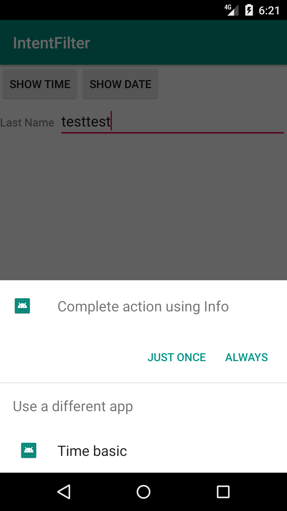


- # Возвращение результатов из интента
Часто требуется запустить активность для того, чтобы получить из нее какой-либо результат. Для этого изучим механизм возврата значения из активности. 
Добавим в главное окно надпись и кнопку, по нажатию на которую мы будем переходить в другую активность и вводить текст, а при возврате в главную активность этот текст будет отображаться. 
```xml
<LinearLayout
   xmlns:android="http://schemas.android.com/apk/res/android"
   android:layout_width="fill_parent"
   android:layout_height="fill_parent"
   android:orientation="vertical">
   <Button
       android:id="@+id/btnName"
       android:layout_width="wrap_content"
       android:layout_height="wrap_content"
       android:layout_gravity="center_horizontal"
       android:layout_margin="20dp"
       android:text="Input name">
   </Button>

   <TextView
       android:id="@+id/tvName"
       android:layout_width="wrap_content"
       android:layout_height="wrap_content"
       android:layout_gravity="center_horizontal"
       android:text="Your name is ">
   </TextView>
</LinearLayout>
```

В коде главной активности добавим в обработчик события код вызова новой активности. Обратите внимание, что мы вызываем активность при помощи другого метода.

    intent = new Intent(this, NameActivity.class);
    startActivityForResult(intent, 1);
    break;


Теперь создадим вторую активность и расположим в ней необходимые элементы для удобного ввода текста:

```xml
<LinearLayout
   xmlns:android="http://schemas.android.com/apk/res/android"
   android:layout_width="match_parent"
   android:layout_height="match_parent"
   android:orientation="vertical">

   <LinearLayout
       android:id="@+id/linearLayout1"
       android:layout_width="match_parent"
       android:layout_height="wrap_content"
       android:layout_margin="10dp">

       <TextView
           android:id="@+id/textView1"
           android:layout_width="wrap_content"
           android:layout_height="wrap_content"
           android:text="Name">
       </TextView>

       <EditText
           android:id="@+id/etName"
           android:layout_width="wrap_content"
           android:layout_height="wrap_content"
           android:layout_marginLeft="10dp"
           android:layout_weight="1">
           <requestFocus>
           </requestFocus>
       </EditText>

   </LinearLayout>
   <Button
       android:id="@+id/btnOK"
       android:layout_width="wrap_content"
       android:layout_height="wrap_content"
       android:layout_gravity="center_horizontal"
       android:text="OK">
   </Button>
</LinearLayout>
```

В коде главной активности создадим обработчик нажатия на кнопку. В нем мы создаем интент, в который поместим возвращаемую информацию. Обратите внимание на вызов 
метода finish(). 

```java
@Override
public void onClick(View v) {
   Intent intent = new Intent();
   intent.putExtra("name", etName.getText().toString());
   setResult(RESULT_OK, intent);
   finish();
}
```

Теперь возвращаемся в главную активность. Здесь мы должны определить метод, обрабатывающий обратный интент:

```java
@Override
protected void onActivityResult(int requestCode, int resultCode, Intent data) {
   if (data == null) {return;}
   String name = data.getStringExtra("name");
   tvName.setText("Your name is " + name);
}
```

Проверим работоспособность нашего приложения:


## Контрольные вопросы
Какие существуют соглашения в порядке наименования действий?

Как передать информацию в активность используя неявный вызов?

Какие еще параметры можно задавать при создании неявного интента?

Зачем нужна категория в интент-фильтрах? Какие существуют категории?

Зачем нужен элемент  <requestFocus>?

Зачем нужны аргументы requestCode и resultCode в обратном интенте?

## Дополнительные задания
Создайте приложение, на главном окне которого будет расположено поле ввода текста и при нажатии на кнопку “перейти” будет запускаться браузер по введенному пользователем адресу.

Создайте приложение, отвечающее на какое-либо стандартное системное действие. Проверьте его работоспособность.

Создайте приложение, которое выводит текстовую надпись и предлагает выбрать цвет и выравнивание надписи. Выбор должен производиться в двух разных активностях. При возврате в основную активность форматирование надписи должно меняться. 

(*) Создайте приложение, запускающее приложение камеры. Когда пользователь делает снимок, он должен вернуться в наше приложение, и оно должно отобразить его в виде миниатюры на экране.

- # Практика: Возврат результата	
	Видео		https://www.youtube.com/watch?v=fVqwsoTCoUU
- # Практика: Использование системных активностей
	Видео		https://www.youtube.com/watch?v=EK1m0O0UEQw
- # Практика: Работа с действием Send		
    Видео	https://www.youtube.com/watch?v=xUCXJmnBToM

- # Работа с графическими элементами

Цель работы

    Освоить работу с базовыми визуальными элементами Android Studio и
    способы организации архитектуры приложения на Android.

## Задание

На основе лабораторных работ «MD1.1 Основные элементы» и «MD2.2
Фильтры намерений» реализуйте приложение «Список дел», состоящее из
нескольких экранов. На главном экране реализована навигация по
существующим категориям. 
При переходе на каждую категорию
реализовать возможность добавления новых дел.

При оформлении приложения не оставляйте стандартного оформления,
поменяйте цвета навигации.

Также поменяйте иконку приложения.
Создать иконку можно в Figma (512 х 512 px): https://www.figma.com/

Для того чтобы добавить своё изображение в проект, в
программе Android Studio, в каталоге Вашего проекта, найдите
путь: app &gt; src &gt; res и вызовите контекстное меню (правой кнопкой
мыши):

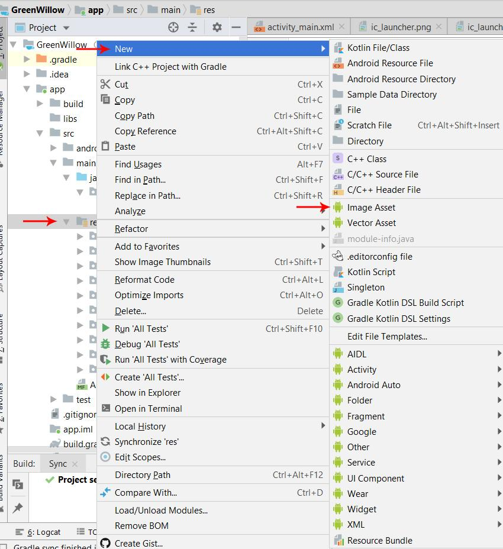

Здесь, как можно увидеть на скриншоте, мы выбираем: New > Image Asset. И попадаем во вкладку, где необходимо указать путь к изображению, задать ему имя и выбрать тип (в нашем случае Image):

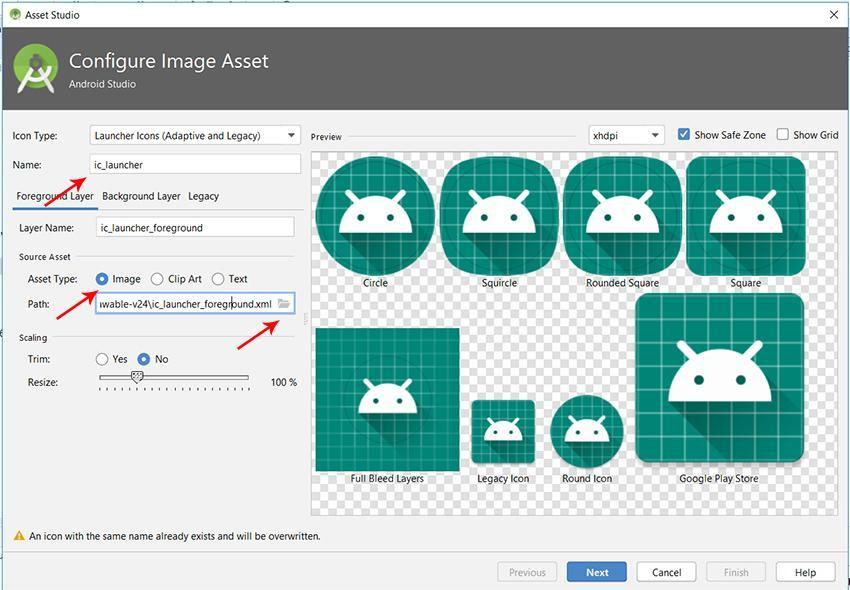

Изображение, это файл с расширением *.png, с разрешением 512х512 точек. Для примера, я взял png с разрешением 256х256, чтобы можно было почувствовать разницу. После чего нажимаем Next.

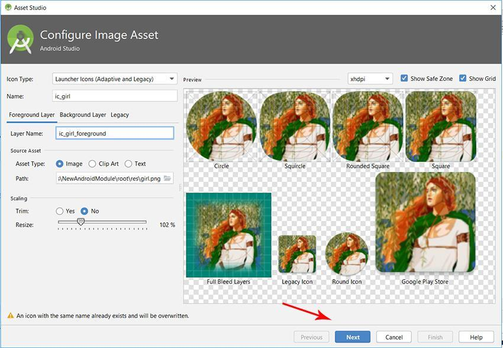

После чего мы видим сообщение о том, что будет заменено текущее изображение загрузчика.

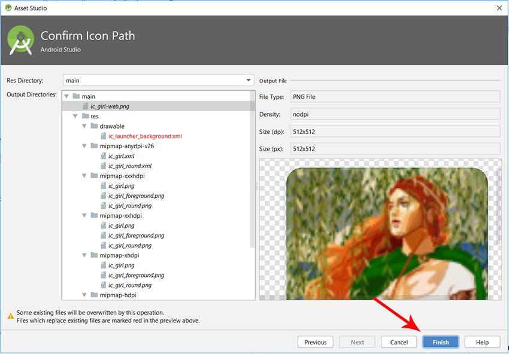

Кстати текущее изображение, можно загрузить и на рабочую область.

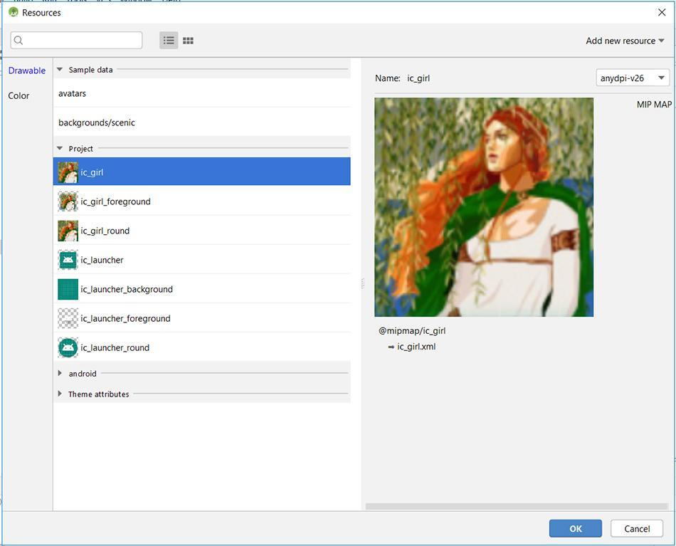

Здесь как раз отчётливо видна разница между изображениями 256х256 и 512х512.

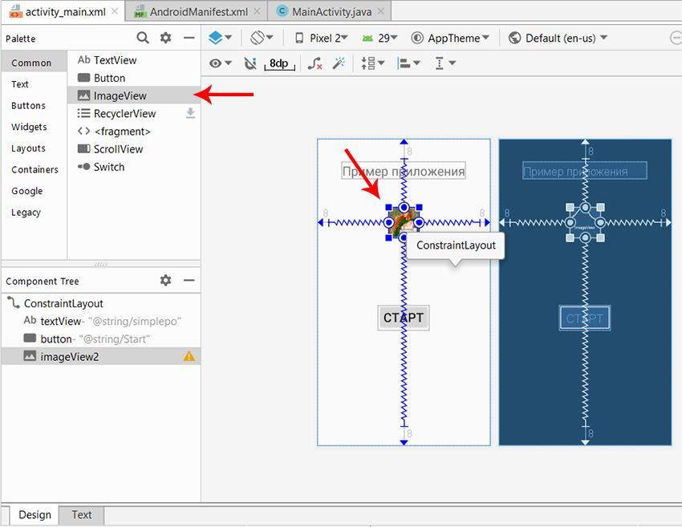

 И кстати, если Вам необходимо добавить изображение для Вашего проекта, то выбрав New > Image Asset, укажите панель Action Bar and Tab Icons.

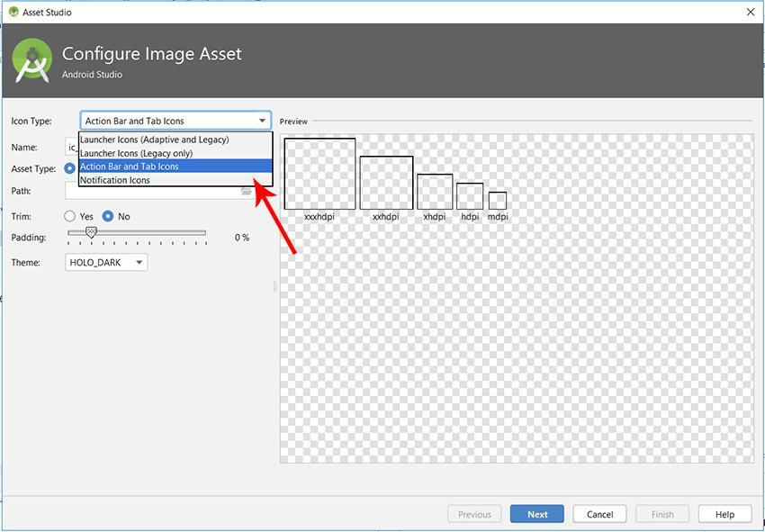

## Контрольные вопросы
1. Что такое событийно-ориентированное программирование?
2. Какие события вы использовали в своем приложении?
3. С помощью какого класса предоставляется доступ к ресурсам из кода Java?
4. Какие основные квалификаторы ресурсов вы знаете?
5. Какие основные XML-атрибуты используются для задания расположения виджета на экране?
6. Какие основные XML-атрибуты используются для задания отображения виджета на экране?
7. Какие существуют соглашения в порядке наименования действий?
8. Как передать информацию в активность используя неявный вызов?
9. Какие еще параметры можно задавать при создании неявного интента?
10. Зачем нужна категория в интент-фильтрах? Какие существуют категории?
11. Зачем нужен элемент  <requestFocus>?
12. Зачем нужны аргументы requestCode и resultCode в обратном интенте?
13. Зачем делить приложение на несколько окно? Почему нельзя использовать разные расположения?
14. Что такое интент и зачем он нужен?
15. Как вызвать определенное окно своего приложение? А другого?
16. Что такое таск? Почему при перемещении между окнами работает кнопка “Назад”?

## Дополнительные задания
1. Создайте приложение, на главном окне которого будет расположено поле ввода текста и при нажатии на кнопку “перейти” будет запускаться браузер по введенному пользователем адресу.
2. Создайте приложение, отвечающее на какое-либо стандартное системное действие. Проверьте его работоспособность.
3. Создайте приложение, которое выводит текстовую надпись и предлагает выбрать цвет и выравнивание надписи. Выбор должен производиться в двух разных активностях. При возврате в основную активность форматирование надписи должно меняться. 
4. (*) Создайте приложение, запускающее приложение камеры. Когда пользователь делает снимок, он должен вернуться в наше приложение, и оно должно отобразить его в виде миниатюры на экране.

- # Создание главного меню приложения

Цель работы

    Познакомиться с инструментами и приемами создания меню мобильного приложения и способами взаимодействия с ним.

## Методические указания
Простое меню

Откроем MainActivity.java. За создание меню отвечает метод onCreateOptionsMenu. На вход ему подается объект типа Menu, в который мы и будем добавлять свои пункты.
Добавьте в Activity этот метод:
```java
public boolean onCreateOptionsMenu(Menu menu) {
  // TODO Auto-generated method stub
   
  menu.add("menu1");
  menu.add("menu2");
  menu.add("menu3");
  menu.add("menu4");
   
  return super.onCreateOptionsMenu(menu);
}
```

Пункты меню добавляются методом add. На вход методу подается текст пункта меню. Добавим 4 пункта.
Метод onCreateOptionsMenu должен вернуть результат типа boolean. True – меню показывать, False – не показывать. Т.е. можно было бы накодить проверку какого-либо условия, и по итогам этой проверки не показывать меню передавая False. Пока нам это не нужно, поэтому поручаем этот выбор методу суперкласса, по умолчанию он возвращает True.

## Создание обработчика нажатия

Появилось 4 пункта меню. Нажатие на них ни к чему не приводит, т.к. не реализован обработчик. Обработчиком является Activity, а метод зовется onOptionsItemSelected. На вход ему передается пункт меню, который был нажат – MenuItem. Определить, какое именно меню было нажато можно по методу getTitle. Давайте выводить всплывающее сообщение с текстом нажатого пункта меню. На выходе метода надо возвращать boolean. И мы снова предоставляем это суперклассу.
```java
public boolean onOptionsItemSelected(MenuItem item) {
  // TODO Auto-generated method stub
  Toast.makeText(this, item.getTitle(), Toast.LENGTH_SHORT).show();
  return super.onOptionsItemSelected(item);
}
```

Определять нажатый пункт меню по тексту – это не самый лучший вариант. Далее будем делать это по ID. Но для этого надо немного по другому создавать меню.

## Меню с группировками
Рассмотрим другую реализацию этого метода - add(int groupId, int itemId, int order, CharSequence title). У этого метода 4 параметра на вход: 
- groupId - идентификатор группы, частью которой является пункт меню
- itemId - ID пункта меню
- order - для задания последовательности показа пунктов меню
- title - текст, который будет отображен
Чтоб показать как используются все эти параметры, создадим приложение. На экране будет TextView и CheckBox:
- TextView будет отображать какой пункт меню был выбран
- CheckBox будет определять показывать обычное меню или расширенное. Это будет реализовано с помощью групп меню.
Откроем main.xml, присвоим ID существующему TextView, сотрем его текст и создадим CheckBox. Код:
```xml
<?xml version="1.0" encoding="utf-8"?>
<LinearLayout
    xmlns:android="http://schemas.android.com/apk/res/android"
    android:orientation="vertical"
    android:layout_width="fill_parent"
    android:layout_height="fill_parent">
    <CheckBox
        android:layout_width="wrap_content"
        android:layout_height="wrap_content"
        android:id="@+id/chbExtMenu"
        android:text="расширенное меню">
    </CheckBox>
    <TextView
        android:layout_width="fill_parent"
        android:layout_height="wrap_content"
        android:id="@+id/textView">
    </TextView>
</LinearLayout>
```

Открываем MainActivity.java и класс MainActivity заполняем следующим кодом:
```java
public class MainActivity extends Activity {
   
  // Элементы экрана
  TextView tv;
  CheckBox chb;
   
   
    /** Called when the activity is first created. */
    @Override
    public void onCreate(Bundle savedInstanceState) {
        super.onCreate(savedInstanceState);
        setContentView(R.layout.main);
        // находим элементы
        tv = (TextView) findViewById(R.id.textView);
        chb = (CheckBox) findViewById(R.id.chbExtMenu);
         
    }
     
    // создание меню
    @Override
    public boolean onCreateOptionsMenu(Menu menu) {
      // TODO Auto-generated method stub
      // добавляем пункты меню
      menu.add(0, 1, 0, "add");
      menu.add(0, 2, 0, "edit");
      menu.add(0, 3, 3, "delete");
      menu.add(1, 4, 1, "copy");
      menu.add(1, 5, 2, "paste");
      menu.add(1, 6, 4, "exit");
       
      return super.onCreateOptionsMenu(menu);
    }
     
    // обновление меню
    @Override
    public boolean onPrepareOptionsMenu(Menu menu) {
      // TODO Auto-generated method stub
      // пункты меню с ID группы = 1 видны, если в CheckBox стоит галка
      menu.setGroupVisible(1, chb.isChecked());
      return super.onPrepareOptionsMenu(menu);
    }
 
    // обработка нажатий
    @Override
    public boolean onOptionsItemSelected(MenuItem item) {
      // TODO Auto-generated method stub
      StringBuilder sb = new StringBuilder();
 
      // Выведем в TextView информацию о нажатом пункте меню 
      sb.append("Item Menu");
      sb.append("\r\n groupId: " + String.valueOf(item.getGroupId()));
      sb.append("\r\n itemId: " + String.valueOf(item.getItemId()));
      sb.append("\r\n order: " + String.valueOf(item.getOrder()));
      sb.append("\r\n title: " + item.getTitle());
      tv.setText(sb.toString());
       
      return super.onOptionsItemSelected(item);
    }
} 
```

Давайте разбирать написанное. Мы используем следующие методы:

- onCreateOptionsMenu - вызывается только при первом показе меню. Создает меню и более не используется. Здесь мы добавляем к меню пункты.
- onPrepareOptionsMenu - вызывается каждый раз перед отображением меню. Здесь мы вносим изменения в уже созданное меню, если это необходимо
- onOptionsItemSelected - вызывается при нажатии пункта меню. Здесь мы определяем какой пункт меню был нажат.

В методе onCreateOptionsMenu мы добавляем 6 пунктов меню. Обратим внимание на параметры метода Add.
- Первый параметр – ID группы. В первых трех пунктах он равен нулю, в оставшихся трех – 1. Т.е. пункты меню copy, paste и exit объединены в группу с ID = 1. Визуально это никак не проявляется - они не отличаются цветом или еще чем-либо. ID группы мы будем использовать в реализации onPrepareOptionsMenu.
- Второй параметр – ID пункта меню. В обработчике используется для определения какой пункт меню был нажат. Будем использовать его в onOptionsItemSelected.
- Третий параметр – определяет позицию пункта меню. Этот параметр используется для определения порядка пунктов при отображении меню. Используется сортировка по возрастанию, т.е. от меньшего order к большему.
- Четвертый параметр – текст, который будет отображаться на пункте меню. 

В метод onPrepareOptionsMenu передается объект Menu и мы можем работать с ним. В данном примере вызываем setGroupVisible. Этот метод позволяет скрывать\отображать пункты меню. На вход подается два параметра – ID группы и boolean-значение. В качестве ID группы мы пишем – 1 (та самая группа с ID = 1, в которой находятся пункты copy, paste и exit), а в качестве boolean параметра используем состояние CheckBox. Если он включен, то пункты меню (из группы с ID = 1) будут отображаться, если выключен – не будут.

В зависимости от состояния CheckBox в меню видно 3 или 6 пунктов.

Обратите внимание на порядок пунктов. Они отсортированы по параметру order по возрастанию. Если order у нескольких пунктов совпадает, то эти пункты размещаются в порядке их создания в методе onCreateOptionsMenu.

При нажатии на какой-либо пункт меню срабатывает метод onOptionsItemSelected. В нем мы выводим в TextView информацию о нажатом пункте. Можете сверить эту информацию с тем, что мы кодили при создании пунктов меню. Все параметры должны совпадать. Порядок, для удобства, я сделал такой же как и в методе add: groupId, itemId, order, title.
## Создание меню в отдельном файле
Есть еще один, более удобный и предпочтительный способ создания меню - с использованием xml-файлов, аналогично layout-файлам при создании экрана. Чтобы получить меню, которые мы создавали программно на этом уроке, надо создать в папке res/menu файл mymenu.xml:
```xml
<?xml version="1.0" encoding="utf-8"?>
<menu
    xmlns:android="http://schemas.android.com/apk/res/android">
    <item
        android:id="@+id/menu_add"
        android:title="add">
    </item>
    <item
        android:id="@+id/menu_edit"
        android:title="edit">
    </item>
    <item
        android:id="@+id/menu_delete"
        android:orderInCategory="3"
        android:title="delete">
    </item>
    <group
        android:id="@+id/group1">
        <item
            android:id="@+id/menu_copy"
            android:orderInCategory="1"
            android:title="copy">
        </item>
        <item
            android:id="@+id/menu_paste"
            android:orderInCategory="2"
            android:title="paste">
        </item>
        <item
            android:id="@+id/menu_exit"
            android:orderInCategory="4"
            android:title="exit">
        </item>
    </group>
</menu>
```

Если в папке res нет папки меню, создайте ее. Правой кнопкой на res, выбирайте New > Android Resource Directory, в Resource type выбирайте menu и жмите OK.

item - это пункт меню, group - группа. В атрибутах ID используем ту же схему, что и в ID экранных компонентов, т.е. пишем \@+id/<your_ID> и Eclipse сам создаст эти ID в R.java. Атрибут orderInCategory - это порядок пунктов, а title - текст.

В методе onCreateOptionsMenu нам теперь не надо вручную кодить создание каждого пункта, мы просто свяжем menu, который нам дается на вход и наш xml-файл. 

    public boolean onCreateOptionsMenu(Menu menu) {
    getMenuInflater().inflate(R.menu.mymenu, menu);
    return super.onCreateOptionsMenu(menu);
    }
С помощью метода getMenuInflater мы получаем MenuInflater и вызываем его метод inflate. На вход передаем наш файл mymenu.xml из папки res/menu и объект menu. MenuInflater берет объект menu и наполняет его пунктами согласно файлу mymenu.xml.

Если захотите скрыть группу, выполняете тот же метод setGroupVisible и передаете туда R.id.group1 в качестве ID группы.
## Дополнительные задания
Попробуйте добавить еще несколько пунктов в меню, чтобы их стало больше шести. И обратите внимание, как они отобразятся.

Реализуйте меню с пунктом “выход”, при выборе которого приложение должно закрыться.

Модифицируйте игру “Угадай число” таким образом, чтобы в меню можно было выбирать уровень сложности, начинать новую игру и выходить из приложения.

- # Практика: Главное меню	
	Видео		https://www.youtube.com/watch?v=3pGbaWf9lt8
	
- # Практика: Всплывающее меню
	Видео		https://www.youtube.com/watch?v=0qbGA7zliac
- # Практика: ListView	
	Видео	https://www.youtube.com/watch?v=UlcGSP4OpO8

- # Создание контекстного меню
Цель работы

    Научиться создавать и использовать контекстное меню на отдельных элементах приложения
## Методические указания
Контекстное меню вызывается в Андроид длительным нажатием на каком-либо экранном компоненте. Обычно оно используется в списках, когда на экран выводится список однородных объектов (например письма в почт.ящике) и, чтобы выполнить действие с одним из этих объектов, мы вызываем контекстное меню для него. Но т.к. списки мы еще не проходили, сделаем пример попроще и будем вызывать контекстное меню для TextView.

Откроем main.xml и нарисуем там два TextView:
```xml
<?xml version="1.0" encoding="utf-8"?>
<LinearLayout
    xmlns:android="http://schemas.android.com/apk/res/android"
    android:orientation="vertical"
    android:layout_width="fill_parent"
    android:layout_height="fill_parent">
    <TextView
        android:layout_height="wrap_content"
        android:textSize="26sp"
        android:layout_width="wrap_content"
        android:id="@+id/tvColor"
        android:layout_marginBottom="50dp"
        android:layout_marginTop="50dp"
        android:text="Text color">
    </TextView>
    <TextView
        android:layout_width="fill_parent"
        android:layout_height="wrap_content"
        android:textSize="22sp"
        android:id="@+id/tvSize"
        android:text="Text size">
    </TextView>
</LinearLayout>
```

Для первого TextView мы сделаем контекстное меню, с помощью которого будем менять цвет текста. Для второго – будем менять размер текста.

Принцип создания контекстного меню похож на создание обычного меню. Но есть и отличия.

Метод создания onCreateContextMenu вызывается каждый раз перед показом меню. На вход ему передается:

- ContextMenu, в который мы будем добавлять пункты
- View - элемент экрана, для которого вызвано контекстное меню
- ContextMenu.ContextMenuInfo – содержит доп.информацию, когда контекстное меню вызвано для элемента списка. Пока мы это не используем, но, когда будем изучать списки, увидим, что штука полезная.

Метод обработки onContextItemSelected аналогичный методу onOptionsItemSelected для обычного меню. На вход передается MenuItem – пункт меню, который был нажат.

Также нам понадобится третий метод registerForContextMenu. На вход ему передается View и это означает, что для этой View необходимо создавать контекстное меню. Если не выполнить этот метод, контекстное меню для View создаваться не будет.

Давайте кодить, открываем MainActivity.java. Опишем и найдем TextView и укажем, что необходимо создавать для них контекстное меню.
TextView tvColor, tvSize;
```java 
  /** Called when the activity is first created. */
  @Override
  public void onCreate(Bundle savedInstanceState) {
      super.onCreate(savedInstanceState);
      setContentView(R.layout.main);
       
      tvColor = (TextView) findViewById(R.id.tvColor);
      tvSize = (TextView) findViewById(R.id.tvSize);
       
      // для tvColor и tvSize необходимо создавать контекстное меню
      registerForContextMenu(tvColor);
      registerForContextMenu(tvSize);
           
  }
```

Теперь опишем создание контекстных меню. Используем константы для хранения ID пунктов меню.
```
final int MENU_COLOR_RED = 1;
final int MENU_COLOR_GREEN = 2;
final int MENU_COLOR_BLUE = 3;
 
final int MENU_SIZE_22 = 4;
final int MENU_SIZE_26 = 5;
final int MENU_SIZE_30 = 6; 
```

И создаем
```java
@Override
public void onCreateContextMenu(ContextMenu menu, View v,
    ContextMenuInfo menuInfo) {
  // TODO Auto-generated method stub
  switch (v.getId()) {
case R.id.tvColor:
  menu.add(0, MENU_COLOR_RED, 0, "Red");
  menu.add(0, MENU_COLOR_GREEN, 0, "Green");
  menu.add(0, MENU_COLOR_BLUE, 0, "Blue");
  break;
case R.id.tvSize:
  menu.add(0, MENU_SIZE_22, 0, "22");
  menu.add(0, MENU_SIZE_26, 0, "26");
  menu.add(0, MENU_SIZE_30, 0, "30");
  break;
}
}
```
Обратите внимание, что мы по ID определяем View, для которого вызвано контекстное меню и в зависимости от этого создаем определенное меню. Т.е. если контекстное меню вызвано для tvColor, то мы создаем меню с перечислением цветов, а если для tvSize – с размерами шрифта.

В качестве ID пунктов мы использовали константы. Группировку и сортировку не используем, поэтому используем нули в качестве соответствующих параметров.

Можно все сохранить и запустить. При долгом нажатии на TextView должны появляться контекстные меню.
## Дополнительные задания
Создайте приложение-текстовый редактор


